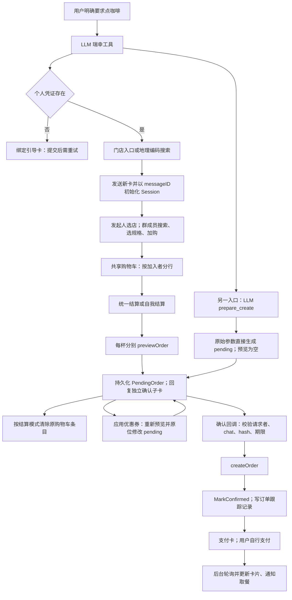
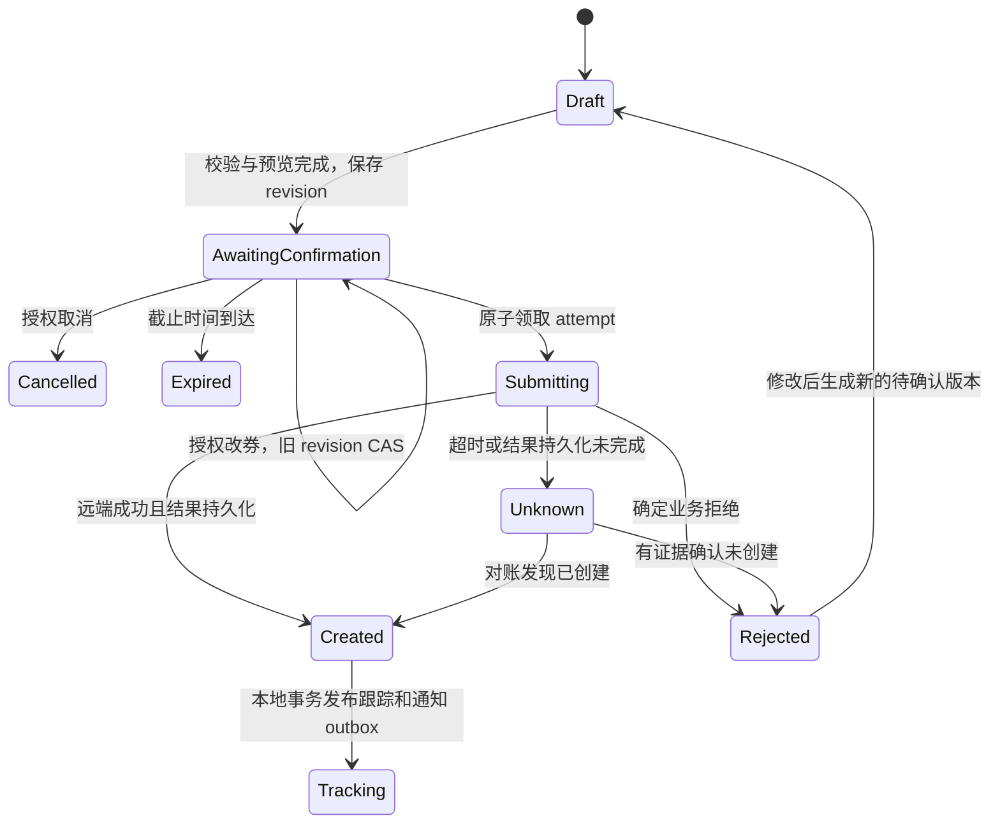

# 瑞幸下单链路设计审查（2026-09-08）

初次审查结论：链路具备显式工具白名单、卡片确认、个人凭证加密、购物车行归属与订单轮询，但**尚不能保证一次确认只创建一个远端订单，也不能保证购物车、确认内容与实际使用账号在并发操作下保持一致**。以下 L1—L10 保留修改前的静态证据，不代表已经发生真实重复订单或凭证泄漏。账号归属已按下述用户决策单独修复；提交状态机与结算一致性问题仍待后续处理。

## 已明确的产品规则与账号修复

用户于 2026-09-08 明确：**自我下单必须使用用户各自自己的个人瑞幸账号，不能使用发起人的账号。** 该规则已经确定，不再将“经发起人授权代用其账号”作为自我下单的候选设计。

- 自我结算只选当前用户加入的商品，预览和 pending 使用当前用户个人 scope；统一结算仍由发起人使用自己的账号。缺少当前用户凭证时引导其绑定，不回退，也不移除购物车商品。
- Confirm 在取 token 前校验个人 scope 与 requester 相同；旧版 requester B / scope A 的待确认订单即使没有 CheckoutMode，也拒绝继续创建，提示重新结算。旧单仍可取消。
- 改券先验证 requester、chat、app/bot 和账号归属，再读取同一账号的凭证；改券保留原到期时间。L2 的授权缺口已处理，改券与确认的原子 CAS/竞态尚未解决。
- 手动查询按 app/bot/order ID 读取订单，并校验 chat；手动查询和后台轮询均用订单保存的 CredentialScope。历史已经在 A 账号创建的订单仍用 A 查询，不把已存在订单的账号强改为 B。
- 新增 checkoutEffects、orderStatusService 等实例注入边界，测试可执行真实应用流程并用 fake MCP、凭证仓库、卡片发送与锁替身验证。未新增 schema 或更改订单状态机。
- 购物车使用通用“去结算”按钮，并同时解释两种模式的账号规则；确认卡按持久化的账号归属显示下单账号，兼容数据库恢复后缺少 CheckoutMode 的记录。

修复验证：按工作区 Go 1.26 基线执行 `luckin`、`luckinaction`、`mcpbridge`、`handlers`、`cmd/larkrobot` 五个包，190 个顶层测试通过；另有 1 个隔离的订单查询仓库测试通过。独立审查发现的两处卡片文案问题已补充回归测试并修复。上述结果覆盖账号修复，不代表下述提交状态机、购物车并发与可靠投递问题已经解决。

主要实现：`luckinaction/checkout_action.go`、`luckin/confirmation_service.go`、`luckinaction/select_action.go`、`luckinaction/order_status.go`、`luckinaction/poller.go`、`mcpstore/orders.go`；路径均位于 `internal/application/lark` 或 `internal/infrastructure` 对应目录。

## 2026-09-09：优惠券失败恢复

用户确认优惠券失败后需要刷新卡片并允许重新提交。新增工具级 `ToolError` 区分 `isError=true` 与传输/RPC 异常；仅匹配明确的券自身拒绝语义，服务/协议/认证异常不进入安全重提分支。当前使用保守文本白名单，未声称已验证瑞幸所有远端业务码或异常格式。

明确券拒绝后在确认服务内清除选券并重新预览原 payload，保留商品、账号、其他参数、ID 与原期限；保存报价后刷新原子卡，等待用户再次确认。预览必须包含有效价格；失败时给出只执行预览的刷新按钮。创建尝试后的不确定错误不再直接展示确认/改券按钮。

`UpdateDraft` 增加旧 hash、pending、有效期的 CAS，刷新 hash 链包含旧版本、payload 和报价，因此同一选券下价格改变也会使旧确认失效。卡片回写前读回状态与版本，支持草稿实际写入成功但确认响应丢失的恢复；旧回调、锁忙、已完成回调不再提前把卡片盖成“处理中”。

边界：这未实现持久化 submitting/unknown、账号级跨卡资源协调、购物车批次预占，不能保证远端 exactly-once。读回到飞书 patch 仍有时间窗，完整卡片投递顺序需要后续版本化发布；L1、L4、L5、L9、L10 仍待处理，L2 的草稿更新 CAS 与 L8 的提前覆盖已局部修复，但改券与远端创建之间仍缺原子提交占用。没有 schema 变更或真实下单。验证：六个相关包 212 个顶层测试、3 个隔离存储测试通过，双子单争券用例的 race 检测通过。

## 范围与证据口径

已阅读根 `AGENTS.md`、`Agents.md`、`docs/superpowers/specs/2026-06-15-luckin-mcp-integration-design.md`、相应 integration plan、`docs/luckin_mcp_usage.md`；追踪 `luckin`、`luckinaction`、`handlers/luckin*`、`mcpbridge`、`mcpclient`、`mcpstore`、卡片分发注册及相关测试。文件引用均以仓库根目录为基准，L1—L10 的行号对应初次审查、账号修复前的工作区快照。

初次审查阶段仅新增本报告，未修改生产代码或执行测试；之后用户明确账号规则，已实施顶部记录的修复并运行本地测试。整个过程未修改数据库 schema 或生成模型，未执行真实下单或飞书消息发送，也未读取 `.dev` 配置内容、真实订单或凭证。本文不对远端幂等、实际部署副本数、真实权限和支付行为作未经验证的断言。后续涉及 schema 的实现仍须遵循仓库 DB 变更 SOP，先 SQL，再由用户执行 SQL 和生成模型。

优先级：P1 为应在继续扩大使用范围前修复的订单正确性/授权问题；P2 为恢复、隔离加固、可用性与维护问题。严重问题均给出触发条件、代码证据和具体后果。

## 实际入口与用户流程

普通聊天工具在 `internal/application/lark/handlers/tools.go:73` 注册瑞幸工具；runtime capability 工具通过同文件 `:93` 的 `larktools(ctx)` 复用工具集。调度入口没有注册下单准备能力，现有 `handlers/luckin_tools_test.go:19` 验证该边界。`luckin/tools.go:24` 的显式策略提供搜索、详情、规格切换、预览、订单查询、绑定引导与 `luckin_order_prepare_create`，没有直接把远端 `createOrder` 暴露给模型。

卡片由 `internal/interfaces/lark/handler.go:224` 注册 `luckinaction.Register()`，后者在 `luckinaction/card_action.go:23` 绑定选店、搜索、加购、结算、优惠券、确认/取消、状态与凭证操作。普通异步动作经 `cardaction/registry.go:242` 启动 `go task(context.WithoutCancel(ctx))`；它没有持久任务队列或整个任务的总截止时间。

与旧说明的重要差异：当前 resolver **只用个人 token**（`luckin/credentials.go:76`），会话 TTL 为 **7 天**、历史 30 天（`mcpstore/session.go:19`），不是 30 分钟；当前默认轮询间隔 5 秒，worker tick 3 秒，待付款决策把间隔压到最多 1 秒；结算会拆成单杯独立确认卡，而不是一直在一张卡完成。`docs/luckin_mcp_usage.md` 中三类凭证、30 分钟会话、30 秒轮询与现状不同，不能据旧文档推断权限和超时。

## 状态与所有权

| 对象 | 实际主键/存储 | 当前职责与缺口 |
|---|---|---|
| 个人凭证 | provider + app + bot + scope + scope ID；PostgreSQL 加密 | 新流程只解析个人 scope；pending 保存 scope，没有绑定凭证版本/账号身份 |
| 用户偏好 | app + bot + chat + user；L1 + Redis | 最近门店与 Seen；LLM 无 session ID 时会用最近门店作为下单默认值 |
| OrderSession | provider + app + bot + messageID；L1 + Redis | 发起人、chat、门店、共享购物车、结算模式；无 revision、阶段、进行中的 checkout |
| CartItem | LineID + AddedByOpenID | 同加入者同 SKU 累加；发起人/加入者可改行；数量上限 20，没有 checkout 预占数量 |
| PendingOrder | UUID；PostgreSQL | payload/hash、预览、快照、scope、请求者、期限；无父 session/checkout ID、确认卡 ID、提交尝试 ID |
| OrderRecord | app + bot + remote order ID 查询；PostgreSQL | 支付信息、轮询状态、下一轮时间、失败计数；未显式关联 pending ID，跟踪写入非事务且允许静默失败 |
| 飞书卡片 | messageID | 作为用户视图，却也被用作部分锁的边界；异步回复之间没有版本排序与可靠投递状态 |

Pending 声明了 `pending/confirmed/expired/cancelled/failed`（`luckin/pending.go:16`），当前正常写路径只有创建 pending、确认和取消；过期主要依赖时间检查，失败通常不落失败状态。OrderRecord 的 `expired/failed` 表示**停止跟踪**，不能等同于远端订单已取消。两套状态没有 `submitting/unknown`，购物车也没有 checkout 中间态。

已存在且应保留的边界：凭证查询包含 provider/app/bot/scope；确认从 DB 读 payload 并校验 requester/chat/hash/期限；卡片按钮仅携带 pending ID/hash；Redis 解锁校验持有者 token；pending/order repository 显式绕过通用 query cache；审计 `larkmsg/record.go:257` 会克隆并脱敏卡片表单，`:338` 对 FormValue 逐字段替换，不能据通用审计入口就认定 token 明文泄漏。

## 已证实问题

### L1 · P1：提交前没有原子占用，超时/落库失败可再次执行 createOrder

- 证据：`internal/application/lark/luckin/confirmation_service.go:103` 先读取 pending，`:128` 调用 createOrder，`:141` 才 `MarkConfirmed`；`internal/infrastructure/mcpstore/pending_orders.go:40` 的 CAS 发生在远端副作用之后。`confirmation_service.go:226` 对仍为 pending 的所有这类错误返回可再次确认卡。
- 触发：远端已创建订单但响应丢失；远端成功后 DB 更新失败；两次确认并发通过读取校验。外围 `luckinaction/card_action.go:97` 用的是 **messageID 锁**；`mcpstore/session_lock.go:24` 租约 12 秒且无续租，而 `luckin/tools.go:146` 的单次 MCP 超时是 **15 秒**。一次慢请求在第 12 秒后尚未超时，第二次确认即可重新进入并读取 pending。
- 后果：第二次远端创建请求可能产生重复订单；或者远端成功、本地仍 pending，用户得到失败与重试提示。客户端设置 `MaxRetries: -1`（`mcpclient/client.go:95`）不提供业务层重试安全性；当前代码没有发送专用订单幂等键。是否远端自行去重属于待验证事项，不能据此宣称本地已经保证单次执行。
- 建议：以 pending ID + revision 原子进入 submitting 后才允许调用；持久化 attempt ID 和可恢复的 unknown 状态；重复确认读取并返回当前结果。对连接前失败、确定业务拒绝与请求可能已被接收的失败分别处理。未知结果先对账，不能重新开放创建。若远端支持幂等键，稳定复用该键；数据库 CAS 仍是必要条件。

### L2 · P1：优惠券更新无所有权校验、无旧版本 CAS，并可与确认交错

- 证据：`internal/application/lark/luckinaction/select_action.go:375` 的 handler 仅取 pending ID/hash/券；`:399` 只校验 hash/status/expiry，没有 operator、chat、app/bot 检查；`:405` 直接读取订单保存的 scope 凭证。`:451` 执行 `UpdateDraft`，其实现 `internal/infrastructure/mcpstore/pending_orders.go:105` 只约束 ID、pending、期限，没有旧 hash 条件，也不获取确认使用的锁。
- 触发：群里非请求者点击可见的“应用优惠券”；同卡两次改券先后返回；确认已读旧 payload 并在远端执行时，另一个优惠券请求写入新 hash。
- 后果：非订单所有者能够以所有者账号重新预览并改变草稿；慢响应覆盖新选择。确认与改券交错时，旧 payload 已在远端创建，但 `MarkConfirmed` 因 hash 改变更新零行，又回到 L1 的不确定与重试问题。券是否真正被消耗取决于远端行为，本文不将预览视为已消费。
- 建议：确认、取消、改券共享同一授权函数和 pending revision CAS；submitting 后拒绝改券。异步预览完成后只能在原 revision 仍有效时发布新草稿和卡片。改券继承原 pending 的 ExpiresAt，不由临时 `Draft` 重新生成的对象暗示新期限。

### L3 · P1：self_service 的确认人和账号所有者分离，轮询还会切到另一个账号

- 证据：`internal/application/lark/luckinaction/select_action.go:481` 仅统一模式限制发起人；`:490` 自我模式将 requester 设为当前操作者 B；`:497` 却仍调用 `initiatorCredentialRequest` 使用发起人 A 的凭证。子卡没有原 session，`luckinaction/card_action.go:83` 直接按 pending 检查 B；`confirmation_service.go:119` 按已存的 A scope 真正提交。之后 `luckinaction/poller.go:124` 丢弃 scope ID，按 `record.RequesterOpenID` 解析 B token；手动查状态的 `select_action.go:615` 永远返回 nil session，也只会用点击者凭证。
- 触发：A 发起共享购物车，B 加自己的商品并选择自我下单。没有观察到 A 对这次“B 代表 A 的瑞幸账号确认”进行单独授权的状态或检查。
- 后果：代码允许 B 确认使用 A 的个人账号；即便这是产品期望，也缺少明确可审计授权边界，卡片只显示“个人瑞幸账号”（`luckin/card.go:52`）没有账号所有者。订单创建后后台查询换成 B 账号：B 无 token 会直接停止跟踪，有 token 则可能查询失败。不能称为各人使用各人账号的自助下单。
- 处理：用户已选择各自账号下单，账号执行链已修复，见本报告顶部。继续区分 initiator、item owner、credential owner、confirmer；查询始终使用实际订单的 CredentialLookup。自我下单不支持代用发起人账号。

### L4 · P1：两级 Session 缓存破坏跨副本一致性，持锁也会覆盖新状态

- 证据：`internal/infrastructure/mcpstore/session.go:80` L1 命中直接返回；`:97` 写 Redis 后仅更新本进程 L1，没有其他副本失效机制；`:222` 吞 Redis SET 错误，`:98` 仍更新 L1。接口 Set/Delete 没有 error 返回。
- 触发：实例 A、B 都缓存了购物车 v1；A 获锁写 v2 并释放；B 随后获锁，却从自己的 L1 读 v1，再写 v3。或者 Redis SET 失败但 UI 仍显示成功。
- 后果：合法串行锁内更新仍丢失加购/数量/删除；其他实例可继续使用已被删除的 session。单实例 Redis 失败时用户看到的状态也可能仅存在内存，重启后消失。该缺陷无需同时写同一行就可触发。
- 建议：所有权威购物车读改写走 Redis revision CAS/Lua 或数据库事务；L1 仅缓存不可变快照或用户偏好，不用于写前读。存储接口返回错误，只有持久化成功后才发布确认性的卡片结果；区分“状态不存在”和“存储暂不可用”。

### L5 · P1：结算没有批次/预占，失败和结算中新增商品也会被清除

- 证据：`internal/application/lark/luckinaction/select_action.go:470` 在异步任务开始前读 cart；`:508` 拆单，`:515` 顺序预览/持久化；`:529`、`:534` 失败只 continue，`:540` 忽略发卡错误；直到 `:542` 才持锁，`:548` 按模式删除当前购物车。`internal/application/lark/luckin/checkout.go:29` 统一模式直接返回空车，自我模式删除该用户所有行。
- 触发：一杯预览/保存/发卡失败；结算耗时期间有人新增商品或增加同一行数量；用户双击结算；进程在创建若干 pending 后退出。
- 后果：失败条目被清掉，新增但从未进入此次快照的商品也被清掉；双击对同一快照产生两套独立 pending；半完成批次既不能准确继续，也不能判断哪些杯已分配成功。原购物车、pending 与飞书子卡间没有可恢复关联。
- 建议：先用 cart revision 原子创建 checkout batch，按 LineID + 数量预占；每杯有稳定子项 ID/幂等键和状态。只消费成功归入批次的精确数量，失败释放预占，后来加购保留；发卡投递结果独立记录并可重发既有 pending，不能重新生成新订单草稿。

### L6 · P1：LLM 下单准备绕开统一预览，确认卡可以完全缺少可核对信息

- 证据：`internal/application/lark/mcpbridge/bridge.go:231` 直接使用模型 JSON；`:236` 有最近门店时无条件覆盖 deptId/坐标；`:249` 保存空 `{}` 预览，没有调用 DraftService 或关联先前 `luckin_order_preview` 结果。`luckin/card.go:172` 对空预览显示“未知门店/商品/价格/时间”，但 `:74` 仍显示有效确认按钮。
- 触发：模型调用已注册的 `luckin_order_prepare_create`，即使此前曾独立调用 preview，也不会把其结果绑定进 pending；最近门店与用户本次明确选择不一致时参数还会被覆盖。
- 后果：用户可在不了解门店、商品与金额的卡片上授权创建；payload hash 只能证明后端字节一致，不能证明用户看到过完整可理解的订单内容。该入口与卡片购物车入口对同一领域动作有不同不变量。
- 建议：所有 prepare 路径调用同一 Draft/Checkout 应用服务；必须校验产品、门店、数量、价格快照完整才能生成可确认状态。模型只传结构化购买意图或明确 session/checkout ID；最近门店仅作需用户确认的建议，不覆盖显式选择。

### L7 · P1：规格失败继续加购，慢操作没有门店/页面版本校验

- 证据：`internal/application/lark/luckinaction/select_action.go:254` 仅在 SwitchSpec 成功时更新 SKU，错误时继续流向 `:276` 加购；`:243` 详情获取失败也会回落到直接加购。商品远端操作使用 `:208` 捕获的旧 shop，但 `:272` 重新读 session 后不验证门店是否仍相同。商品搜索 `:120` 完成后直接 `:127` patch，没有 revision 检查。
- 触发：用户选了温度/糖度等规格而远端切换失败；远端查询较慢时发起人切店，旧门店的加购结果后到；两人先后搜索商品、打开规格卡，后启动请求先返回。
- 后果：用户以为选择的规格没有进入 SKU，却仍被加入车；旧门店 SKU 可被加进新门店车；旧结果覆盖新页面。门店服务可能拒绝跨店 SKU，但不能依赖远端拒绝作为本地一致性保障。
- 建议：规格失败应保留输入并给出可重试状态，不执行加购。每次远端操作携带 session revision/shop revision，返回时 CAS；卡片视图也按 revision 更新。个人规格草稿可独立于群共享车，提交时仅合并已确认的规格结果。

### L8 · P2：重复确认覆盖成功卡后直接退出

- 证据：`internal/application/lark/luckinaction/card_action.go:94` 在确认校验前 patch“正在创建”；服务检查出已处理后，`:121` 直接 return，注释虽说不覆盖成功卡，但前面的 patch 已执行。
- 触发：重复/延迟确认事件在上一笔成功卡已经写回后运行，包括旧客户端按钮回放。
- 后果：已确认订单显示“正在创建”，支付入口消失，直到后续轮询状态变化才可能恢复；未付款状态不变时不一定自动修复。非所有者对子卡点击也会先改共享卡再失败。
- 建议：先授权并读取当前状态；已完成操作返回存储的确定性结果卡。处理中 UI 必须由成功取得 submitting 的尝试发布；卡片更新按版本仲裁。

### L9 · P2：成功提交后的跟踪/通知没有可靠交付，恢复链条不完整

- 证据：`internal/application/lark/luckin/confirmation_service.go:172` 跟踪记录 CreateOrder 失败被静默吞掉，与 MarkConfirmed 非同一事务；`luckinaction/poller.go:180` 先写状态，再 `:192` patch/`:194` 取餐通知。投递失败只日志，下一轮远端状态未变化就不会再次生成该节点通知。异步动作 `cardaction/registry.go:249` 没有 durable job。
- 触发：创建成功后的 DB 第二次写失败、进程退出；状态写成功后飞书 patch/取餐通知失败；回调已经 ACK 但 goroutine 尚未完成时退出。
- 后果：真实订单存在却没有后续轮询；用户缺失支付/取餐通知；操作已被平台接受但本地任务丢失，无法按 attempt 恢复。现有 pending ResultJSON 保留了部分恢复依据，但没有自动扫描恢复路径。
- 建议：提交结果、OrderRecord 与 outbox 在本地事务中发布；卡片 patch/通知独立按 event ID 重试，标记已送达版本。远端创建不能与数据库做分布式原子提交，仍须 L1 的 unknown/对账协议；不能只增加事务便宣称解决。

### L10 · P2：轮询租约不足以覆盖批次，且失败不是“连续失败”

- 证据：`internal/application/lark/luckinaction/poller.go:22` 租约 2 分钟、batch 50；`:113` 顺序处理。`mcpstore/orders.go:27` 领取时统一把 next_poll_at 推迟租约；`:60` 的 ApplyUpdate 只按行 ID 更新，没有租约持有者/代次条件。`poller.go:154` 累加 FailCount，但成功分支 `:172` 未重置。`:124` 凭证查询任意错误都停止，而非仅凭证确定失效。
- 触发：50 笔里前几笔查询/飞书响应慢，后续记录在开始处理前租约已过；多 worker 或副本接手。同一订单几次间歇失败夹杂成功；凭证存储短暂失败。
- 后果：并行重复轮询和通知、旧 worker 覆盖新状态；累计五次失败被当作连续失败永久停止；短暂 DB 故障被当凭证失效终止。业务没有恢复入口来继续已经停止的跟踪。
- 建议：小批次及时领取或每笔执行前 claim，使用 owner/fencing token 并续租/条件提交；成功重置连续失败计数，临时基础设施错误退避，确定撤销凭证才暂停并给可恢复提示。配置轮询间隔必须说明实际 tick/并发约束。

## 待验证疑点与较小的确定性不一致

1. **远端幂等与结果对账能力（决定 L1 的最终方案）**：需要官方协议或不触及真实订单的受控契约材料，确认是否支持客户端幂等键、按请求键查询，以及超时后如何定位远端订单。当前静态代码没有此保护，本文未访问真实服务验证。
2. **预览金额与创建金额契约**：payload hash 不包含预览金额或报价身份；确认不重新校验价格，且凭证重绑后按 scope 读最新 token（`confirmation_service.go:119`）。换到另一瑞幸账号后仍可能使用旧报价/券。是否允许报价浮动、是否能绑定 quote ID、远端如何报券冲突需明确；当前卡片已提示预估且不自动支付，不能将所有价差等同于未经授权扣款。
3. **租户及跨卡片回放加固**：`mcpstore/pending_orders.go:28` 仅按 UUID 查 pending；ConfirmRequest 不携带 app/bot，pending 没有记录确认 messageID；`select_action.go:752` 的 requireSession 不比较 sess.ChatID。凭证和 session 本身有 app/bot 维度，确认也有 chat/user/hash 校验，所以不能据此宣称已证实跨租户盗单；但对共享 DB、多机器人、转发卡片，应补充回放测试并把租户/card 绑定写入服务层规则。
4. **多租户轮询路由**：`mcpstore/orders.go:28` 领取所有 app/bot 的 active 记录，虽然 token 查询使用记录的 app/bot，飞书 patch 依赖当前进程 DAL。多机器人是否共 DB、客户端是否会按 record 路由需部署证据；若共库而 DAL 仅当前机器人，须限定领取租户或显式路由发送客户端。
5. **第三方业务响应判定**：`mcpclient/client.go:78` 只凭 MCP IsError 判断工具失败；`confirmation_service.go:145` 在 MarkConfirmed 后才解析订单号。若远端以 IsError=false 包装业务失败或格式变化，可得到没有订单号的“成功”卡；该响应形态尚未证实。应补脱敏契约 fixture 并在落 confirmed 前验证关键字段。
6. **私密绑定卡降级**：`mcpbridge/bridge.go:299` 临时卡失败会把含 token 输入的绑定卡作为普通卡发出。飞书普通卡输入的具体可见范围需受控验证；本审查未证明 token 已暴露。产品应采用私聊绑定等明确私密降级，不把“可达”作为放宽可见范围的理由。
7. **确定的字段/时间不一致**：`mcpstore/pending_orders.go:124`、`:156` 不保存/恢复 CheckoutMode，self_service 草稿从 DB 读回变零值，卡片在改券/错误恢复后会显示统一模式；`select_action.go:474` Normalize 总有默认值，后面空串 fallback 无法生效。ConfirmRequest.Now 在 handler 构建时捕获（`luckinaction/card_action.go:90`），实际远端提交延迟后仍用旧 now 检查期限。应以服务端执行时钟检查并明确期限语义。
8. **日志内容安全与审计覆盖**：绑定表单审计已脱敏，但通用 MCP 远端错误正文仍向日志/卡片传播（`mcpclient/client.go:79`、`luckinaction/card_action.go:216`），是否可能包含敏感 URL/凭证取决于远端内容；需做脱敏错误 fixture 测试。当前没有完整、稳定关联 checkout/pending/attempt/remote order 的生命周期事件记录。

## 可评审的目标设计

建议保留协议层 `mcpclient`、飞书展示适配层和 repository，收敛一个 `OrderingService` 来承载领域规则。文件长度本身不构成设计缺陷；真正的问题是 checkout、coupon、confirm 分散实现互相依赖的不变量，且基础设施接口无法表达持久化失败/并发冲突。无需先引入通用工作流框架。

拟定不变量：

- 一份确认绑定 tenant、checkout item、pending revision、账号所有者/凭证版本、商品与门店快照、可理解报价和 expiresAt。
- 一个 pending revision 至多有一个正在执行的创建 attempt；所有卡片只是该状态的投影。
- 只有明确授权的 actor 可修改或确认；共享加购权限不隐式推出使用另一人账号创建订单的权限。
- 购物车只消费批次已预占且成功进入待确认流程的精确数量；投递重试不生成新 pending。
- 远端结果未知时禁止自动/人工二次 create，直到查询对账确认或显式转交人工处理。
- 通知送达状态与远端订单状态分开，消息失败可以恢复而不回退真实订单状态。

接口建议供评审而非本次实现：`BeginCheckout(tenant, sessionID, expectedRevision, actor, mode)`；`RevisePending(tenant, pendingID, expectedRevision, actor, coupons)`；`ClaimSubmission(tenant, pendingID, revision, actor, attemptID)`；`RecordSubmissionOutcome(attemptID, outcome)`；`ReconcileSubmission(attemptID)`。Repository 返回明确 not-found/conflict/unavailable；Session 返回值应为不可变快照或深拷贝，避免缓存内 slice 被外部修改。产品身份与账号身份独立建模，页面文字据持久化身份渲染。

## 优先修复路线与验收条件

| 顺序 | 工作包 | 验收条件 |
|---|---|---|
| 1 | 统一确认/改券授权；提交占用与 unknown；结果卡重放 | 并发确认、改券交错、超时后重试均不会发出第二次不受控 create；所有不确定结果有可见且可恢复状态 |
| 2 | 明确 self_service 账号语义，统一报价入口 | A 发起/B 自我下单时账号、授权、确认文案、轮询一致；没有完整报价不能确认；模型工具与卡片使用同一 Draft 服务 |
| 3 | Session CAS 与 checkout batch/精确预占 | 两副本更新无丢失；子单失败只释放对应预占；结算中新增商品保留；双击得到同一批次 |
| 4 | Durable job/outbox、订单关联与轮询租约 | 创建成功后任意持久化/投递步骤故障可恢复；取餐通知失败可重试；旧租约持有者不能覆盖新进度 |
| 5 | 卡片 revision、规格错误处理与文档同步 | 慢响应不覆盖新店/新规格；过期回放返回当前视图；使用说明与个人账号、拆杯、TTL、轮询配置一致 |

上述路线涉及新状态/批次/投递字段时，需要单独提交 schema 设计评审和 SQL，不能在用户执行 SQL/生成模型之前直接写依赖新 schema 的代码。可先做不依赖 schema 的授权检查、错误分型、可测试依赖边界及文档同步，但这些不能单独被宣称已经实现远端 exactly-once。

## 测试缺口与后续验证

初次审查时测试覆盖 pending hash/期限、基础身份拒绝、个人 token 选择、卡片结构、拆杯纯函数、轮询决策和部分 MCP fake server，仅阅读未执行。账号修复已另增并执行 checkout、确认、改券、订单查询与卡片回归测试。原 `luckinaction/card_action_test.go:16` 名为 RunsTask，但 `:29` 注释说明只验证同步阶段返回 task，没有执行锁内 Confirm；Session 测试主要是单 store 行为，未覆盖两副本 Redis/L1 一致性；pending repository integration 测试也不是外部副作用与事务边界故障测试。这些状态机/缓存测试缺口仍需后续处理。

下一轮应先注入 Clock、SessionRepository、SubmissionRepository、ToolCaller、CardPublisher 和任务执行器/锁依赖；遵守 Agents.md，不使用包级可变函数 alias 做 mock。使用 fake MCP、fake publisher、可控存储错误与受控并发栅栏，重点验证：

1. 双确认重叠、锁超过 12 秒、远端成功后本地写失败、响应丢失，断言 create 调用次数与 unknown 状态。
2. 确认与改券/取消交错，非请求者改券、跨 chat/tenant/message 回放，以及失效 revision。
3. self_service 的 A/B 账号矩阵、凭证重绑/撤销、查询账号与创建账号一致。
4. 两实例共享 Redis 的加购/删除/切店；Redis 读写失败不得伪装成功。
5. 多杯部分成功、发卡失败、结算中加购/改数量、重复 checkout、进程重启恢复同一批次。
6. 规格切换失败、店铺变更后的慢结果、成功卡后的重复确认，以及消息 patch 顺序。
7. 轮询成功重置失败计数、临时凭证库故障、批次租约过期、投递失败与重试、原始远端错误脱敏。

如执行 Go 验证，先检查 `.vscode/launch.json` 与 `.vscode/settings.json`，按 go.mod 指定工具链，使用 `GOTOOLCHAIN=local BETAGO_CONFIG_PATH=/mnt/RapidPool/workspace/BetaGo_v2/.dev/config.toml /root/.go/go1.26.0/bin/go test -v -tags=custom_skip_vips <无外部副作用的目标包/用例>`。不得为了本审查运行真实凭证、订单或消息集成测试。
