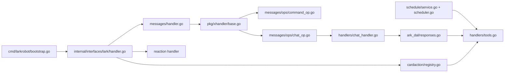
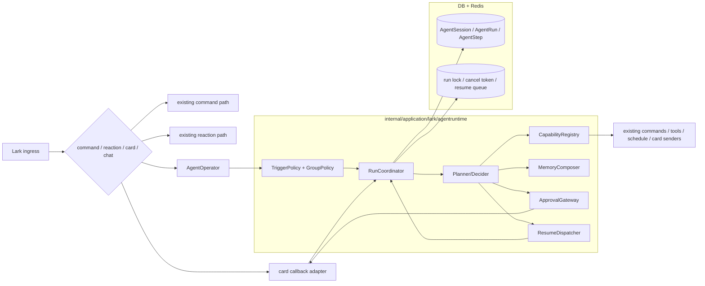
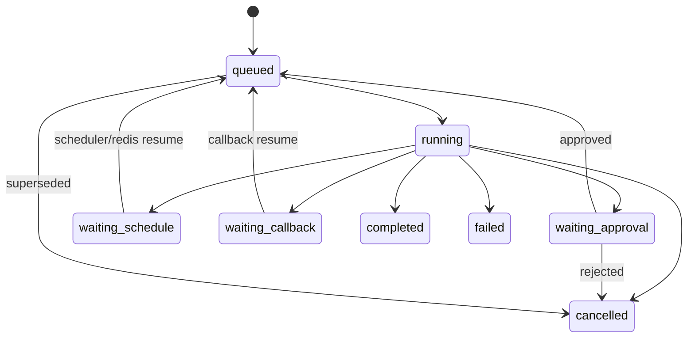

# BetaGo_v2 Agent Runtime Design

## Scope

本文定义一套面向群聊的 `Agent Runtime` 设计，目标是在保留当前 Lark transport、runtime container、typed command/tool、schedule、card callback 等既有能力的前提下，把机器人从“事件驱动 + 单次工具调用循环”演进为“有会话、有运行状态、有等待/恢复能力、可审批、可观测”的 agent。

本文回答七个问题：

1. 当前从入口到触发的真实链路是什么。
2. 它和常见 agent runtime 相比，差距在哪里。
3. 目标架构应该放在仓库里的什么位置。
4. 运行时的核心数据模型和状态机应该是什么。
5. 群聊场景下，机器人应该如何更 agentic，而不是更吵。
6. 现有 command/tool/schedule/card callback 应该如何接入，而不是推翻重写。
7. 如何分阶段落地，并保留明确的回退路径。

Related docs:

- `docs/architecture/runtime-refactor-design.md`
- `docs/architecture/runtime-refactor-plan.md`
- `docs/architecture/runtime-governance.md`
- `docs/adr/0004-scheduler-ha.md`
- `docs/architecture/card-regression-debug-design.md`

## Problem Statement

当前系统的主体形态是：

- `event-driven bot`
- `typed command / tool framework`
- `localized tool-calling loop`

它已经不是“纯命令机器人”，但也还不是完整意义上的 agent runtime。

最关键的现状是：

- Lark websocket 入口、bounded executor、schedule、card callback 都已经被收口到较清晰的运行时结构里。
- `/bb` 与 chat handler 已经具备一轮模型调用与 tool calling 能力。
- schedule 与 card callback 已经提供了“异步执行”和“用户回调”的基础设施。

但这些能力目前仍是离散的：

- 一次消息触发一次局部处理。
- 一次模型响应里做一次局部 tool loop。
- callback 和 schedule 只是业务动作，不是统一 agent run 的 continuation。
- 没有 durable session / run / step。
- 没有统一 orchestrator 来决定“下一步做什么”。

结果是机器人在群聊里仍然更像：

- 被动响应某一条消息
- 在单次上下文里调用几个工具
- 立即给出文本或卡片
- 无法对等待、审批、跨回调恢复、长任务继续推进建立统一语义

这就是当前“不够 agentic”的根因。

## Current Baseline

### Current runtime chain

当前主链路可以概括为：



### Code map

| Area | Primary Files | Current responsibility |
| --- | --- | --- |
| Process bootstrap | `cmd/larkrobot/bootstrap.go` | assemble modules, executors, services |
| Lark transport ingress | `internal/interfaces/lark/handler.go` | message / reaction / card action entry |
| Message processor | `internal/application/lark/messages/handler.go` | xhandler pipeline composition |
| Parallel stage engine | `pkg/xhandler/base.go` | fetcher/operator fan-out with dependency wait |
| Command path | `internal/application/lark/messages/ops/command_op.go`, `internal/application/lark/command/command.go` | typed command dispatch |
| Chat path | `internal/application/lark/messages/ops/chat_op.go`, `internal/application/lark/handlers/chat_handler.go` | ad-hoc chat decision and reply |
| Tool loop | `internal/infrastructure/ark_dal/responses.go`, `internal/application/lark/handlers/tools.go` | model response streaming + function call |
| Schedule runtime | `internal/application/lark/schedule/service.go`, `scheduler.go`, `executor.go` | user-scheduled tool execution |
| Card callback runtime | `internal/application/lark/cardaction/registry.go`, `builtin.go` | immediate callback dispatch and optional async task |
| Outbound Lark replies | `internal/infrastructure/lark_dal/larkmsg/*` | text/card reply and patch |

### What is already good

当前代码里已经有几块非常适合继续复用，而不是推倒：

- `internal/runtime` 已经把进程生命周期、bounded executor、health registry 收住了。
- `xcommand` + typed handler 已经把大量命令参数做成了类型安全结构。
- `handlers/tools.go` 已经有集中 tool registry。
- `schedule` 已经有“异步后续执行”的业务 substrate。
- `cardaction` 已经有 callback -> handler 的桥。
- streaming card 和 patch card 能力已经存在。

这意味着最合理的方向不是“重写一个外部 agent service”，而是“在现有 app 内部增加一个真正的 agent runtime 层”。

## Gap Analysis

和 LangGraph、OpenAI Agents SDK、AutoGen 这一类常见 agent runtime 相比，当前系统主要缺少以下能力。

### 1. No durable run state

当前 `GenerateChatSeq()` + `ResponsesImpl` 只在单次模型响应期间维护局部状态：

- tool call id
- previous response id
- output delta

这些状态不会以 `session -> run -> step` 的形式落盘，也不能在 callback、scheduler、进程切换后稳定恢复。

### 2. No single orchestrator

当前消息进入后会落到 `xhandler` 的并行 operator 体系中。它擅长做“多个能力并行判断/执行”，但不适合承载“单个 agent run 的明确状态机”。

结果是：

- 谁是这次 run 的 owner 不够明确。
- 是否应该继续规划、等待审批、还是结束，没有统一决策点。
- 不同 operator 之间可以共享 meta，但不能形成 durable run graph。

### 3. No explicit step machine

当前没有统一的：

- `plan`
- `act`
- `observe`
- `decide`
- `wait`
- `resume`

状态机。

tool call 虽然存在，但只是模型响应内部的局部 loop，而不是 runtime 级别的 step。

### 4. No approval / interrupt / resume contract

card callback 已经能触发行为，但 callback 目前只是在“完成一个动作”。

它还没有被建模为：

- 对某个 `run_id` 的审批
- 对某个 `run_id` 的继续执行
- 对某个 `run_id` 的取消/打断
- 对某个 `run_id` 的版本校验

### 5. Scheduler is not yet agent-native

`schedule` 当前擅长“执行用户创建的定时任务”，但它还不是 agent runtime 的 continuation substrate。

缺少的不是“有没有异步能力”，而是：

- agent wait step 如何编码
- 谁来 resume run
- 如何跨进程协调
- 如何保证同一个 run 只有一个 worker 在推进

### 6. No run-level observability

现在有 trace、有 executor 指标、有 health status，但还没有：

- 当前 chat 上活跃的是哪个 run
- 一个 run 走了多少 step
- 每步为什么转移状态
- 哪一步请求了审批
- 哪一步触发了外部工具副作用

### 7. Group chat behavior still lacks policy

当前群聊行为主要由：

- 是否提及机器人
- 是否命中 command
- 意图识别 + 频控

来决定。

这对于“减少乱回”是有效的，但对“更 agentic”还不够，因为缺少：

- 群聊中的 run ownership
- follow-up 窗口
- 打断 / supersede 规则
- 主动继续推进的边界

## Design Options

### Option A: 在现有 chat handler 上继续堆功能

做法：继续扩展 `chat_handler.go` 与 `ResponsesImpl`，把审批、等待、恢复等语义都塞进现有 chat loop。

优点：

- 改动面最小。
- 短期能较快出效果。

缺点：

- durable run、callback resume、跨进程协调会被摊平在多个 helper 中。
- chat loop 会进一步膨胀。
- 仍然缺少统一 runtime 边界。

结论：不推荐，适合作为临时过渡，不适合作为目标架构。

### Option B: 在现有应用内部新增 `Agent Runtime`

做法：保留 transport、command、tool、schedule、card callback 现状，在应用层新增一个统一 orchestrator、durable store、capability registry、resume queue。

优点：

- 最贴合当前仓库结构。
- 可以复用现有 typed command / tool / card / schedule 能力。
- 支持渐进式切流和 shadow mode。

缺点：

- 需要引入新的数据模型和状态机。
- 第一阶段需要同时处理“新 runtime”和“旧 chat path”的双轨并存。

结论：推荐方案。

### Option C: 直接拆成外部 sidecar agent service

做法：让 Lark bot 只做 transport，把 agent orchestration 全移到新服务中。

优点：

- 架构边界最干净。
- 未来多实例、多 agent、独立扩缩容更直观。

缺点：

- 现有 command/tool/card/schedule 与 bot 身份体系全部都要穿透重接。
- 风险高，回归面大。
- 不适合当前仓库的增量演进节奏。

结论：不作为当前阶段方案。

## Recommended Architecture

采用 Option B：在现有应用内部增加 `Agent Runtime`，并让它逐步接管“非命令式聊天”和“可持续推进的任务”。

### Topology



### Placement in repository

建议新增一个明确的应用层包，而不是继续把逻辑摊在 `handlers/chat_handler.go` 里：

- `internal/application/lark/agentruntime/`
  - `types.go`
  - `policy.go`
  - `coordinator.go`
  - `planner.go`
  - `capability.go`
  - `memory.go`
  - `approval.go`
  - `resume.go`
  - `operator.go`

配套基础设施建议：

- `internal/infrastructure/agentstore/`
  - `session_repo.go`
  - `run_repo.go`
  - `step_repo.go`
- `internal/infrastructure/redis/agentruntime.go`
  - run lock
  - cancellation token
  - active chat slot
  - resume queue helpers

这里的关键边界是：

- `agentruntime` 决定 run 生命周期和状态机。
- 现有 `handlers/tools.go`、`schedule`、`cardaction` 作为 capability 的被复用对象。
- transport 层不直接知道 agent 内部细节。

## Core Model

### 1. Session

`AgentSession` 表示机器人在某个会话范围内的持续上下文。

建议主键维度：

- `app_id`
- `bot_open_id`
- `chat_id`
- `scope_type`
- `scope_id`

其中：

- 群聊默认 `scope_type=chat`，`scope_id=chat_id`
- 如果未来引入 thread 级 agent，可扩展为 `scope_type=thread`

建议字段：

```go
type AgentSession struct {
    ID               string
    AppID            string
    BotOpenID        string
    ChatID           string
    ScopeType        string
    ScopeID          string
    Status           string
    ActiveRunID      string
    LastMessageID    string
    LastActorOpenID  string
    MemoryVersion    int64
    CreatedAt        time.Time
    UpdatedAt        time.Time
}
```

### 2. Run

`AgentRun` 表示一次可追踪、可恢复的 agent 执行。

建议字段：

```go
type AgentRun struct {
    ID                 string
    SessionID          string
    TriggerType        string // mention, reply, command_bridge, card_callback, schedule_resume
    TriggerMessageID   string
    TriggerEventID     string
    ActorOpenID        string
    ParentRunID        string
    Status             string // queued, running, waiting_approval, waiting_schedule, waiting_callback, completed, failed, cancelled
    Goal               string
    InputText          string
    CurrentStepIndex   int
    WaitingReason      string
    WaitingToken       string
    LastResponseID     string
    ResultSummary      string
    ErrorText          string
    Revision           int64
    StartedAt          *time.Time
    FinishedAt         *time.Time
    CreatedAt          time.Time
    UpdatedAt          time.Time
}
```

### 3. Step

`AgentStep` 是真正的 runtime 单元。和当前局部 tool loop 不同，step 要能稳定落盘并恢复。

```go
type AgentStep struct {
    ID               string
    RunID            string
    Index            int
    Kind             string // decide, plan, capability_call, observe, reply, approval_request, wait, resume
    Status           string // queued, running, completed, failed, skipped
    CapabilityName   string
    InputJSON        []byte
    OutputJSON       []byte
    ErrorText        string
    ExternalRef      string // message_id, callback token, schedule id, response id
    StartedAt        *time.Time
    FinishedAt       *time.Time
    CreatedAt        time.Time
}
```

### 4. Capability metadata

现有 commands/tools 已经能执行，但 agent runtime 还需要知道“怎么安全地执行”。

建议增加 capability 元数据层：

```go
type CapabilityMeta struct {
    Name              string
    Kind              string // command, tool, card_action, schedule, internal
    Description       string
    SideEffectLevel   string // none, chat_write, external_write, admin_write
    RequiresApproval  bool
    SupportsStreaming bool
    SupportsAsync     bool
    SupportsSchedule  bool
    Idempotent        bool
    DefaultTimeout    time.Duration
    AllowedScopes     []string // p2p, group, schedule, callback
}
```

这层元数据不是为了替代现有 handler，而是为了让 orchestrator 有能力做：

- approval gate
- timeout policy
- scope gate
- schedule/resume policy
- observability labeling

## Runtime State Machine

### High-level lifecycle



### Step loop

推荐把当前隐式 chat loop 显式化为：

1. `decide`
2. `compose context`
3. `plan`
4. `execute capability`
5. `observe result`
6. `decide next`
7. `reply / wait / finish`

注意：

- “plan” 不一定意味着要额外多一次模型请求；第一阶段可以复用现有 response/tool loop，只是把 runtime decision 明确落盘。
- 关键不在于 planner 的复杂度，而在于 step 和 run 有 durable identity。

## Group Chat Policy

让机器人在群聊里更 agentic，不等于让它更频繁地说话。相反，需要更强的策略边界。

### Trigger policy

建议只允许以下触发来源进入 agent runtime：

- `@bot`
- 回复 bot 的消息
- 显式 `/bb` 或后续桥接命令
- 某个已存在 run 的 callback / resume

第一阶段不建议让普通自然消息直接触发 agent runtime，避免群聊噪声失控。

### Ownership policy

同一 `chat scope` 下同一时刻只允许一个 active run：

- 新 run 创建时需要抢占 `active chat slot`
- 抢占成功后成为当前 owner
- 抢占失败时由策略决定：排队、拒绝、或 supersede 旧 run

建议第一阶段采用：

- 同 chat 只保留一个 active run
- 明确提及机器人的新消息可以 supersede 旧 run
- 被 supersede 的 run 标记 `cancelled`，原因记录为 `superseded_by_new_input`

### Follow-up window

群聊里需要“短暂连续性”，但不能无限延续。

建议：

- 对最近一次 active run 建一个短 follow-up window，例如 2-5 分钟
- 在窗口内、且用户是同一 actor 或明确回复该 run 结果时，允许附着到当前 session
- 窗口外必须重新显式触发

### Proactive boundary

agent 可以主动继续推进，但必须受限于以下场景：

- 请求审批
- 异步任务完成回报
- 用户显式要求“做好后通知我”
- schedule / callback 驱动的 continuation

不允许在没有等待状态、没有结果交付义务的情况下，自发再次在群里说话。

## Approval, Interrupt, Resume

### Approval

审批应该成为 runtime 一等语义，而不是普通 card action。

建议定义：

```go
type ApprovalRequest struct {
    RunID           string
    StepID          string
    ApprovalType    string
    Title           string
    Summary         string
    CapabilityName  string
    PayloadJSON     []byte
    ExpiresAt       time.Time
}
```

触发流程：

1. planner 判断某 capability `RequiresApproval=true`
2. runtime 持久化 `waiting_approval`
3. 发送审批卡片，卡片 action payload 带 `run_id + step_id + token + revision`
4. callback 到达后校验 revision / token
5. 通过 `ResumeDispatcher` 入队继续执行

### Interrupt / cancel

需要支持三类中断：

- 用户显式取消
- 新输入 supersede 旧 run
- 系统检测到 run 超时或版本冲突

取消不应该只是“停止某个 goroutine”，而应该是：

- 写 run status=`cancelled`
- 增加 cancel generation
- 让正在执行的 worker 在下一步或下一次 capability 边界感知取消

### Resume across processes

如果 callback 到达的不是原始处理进程，仍然必须能恢复。

因此 source of truth 应该是：

- DB: session/run/step
- Redis: 锁、取消代号、resume queue

resume 的正确流程不是“回调里直接继续跑逻辑”，而是：

1. callback 只做验证 + 写状态
2. callback 向 Redis resume queue 推一个 `resume_event`
3. 任一 worker 抢到 run lock 后继续执行

这也是当前系统真正跨进程 agent 化的关键。

## Memory Model

建议把 memory 分成三层，而不是把所有内容都塞给模型。

### Short-term memory

来自：

- 最近消息
- 当前 run 的 step outputs
- 当前会话的最近结论

主要用途：保留最近上下文与当前任务状态。

### Mid-term working memory

来自：

- session summary
- pinned facts
- unresolved todos / waits

主要用途：支撑一次群聊内持续几分钟到几小时的 agent 行为。

### Long-term retrieval

直接复用现有：

- history
- chunking
- retriever
- OpenSearch

这里不建议第一阶段新造一套长期记忆系统，而是先把现有检索能力接到 `MemoryComposer` 里。

## Integration Strategy

### 1. Commands stay first-class

typed command 框架已经很成熟，不应被 agent runtime 替代。

推荐策略：

- `/config`、`/feature`、`/schedule`、`/wordcount` 仍走 command path
- agent runtime 可以通过 capability adapter 调这些 command/tool
- 某些 command 也可以桥接成 `command_bridge` run，以便获得审批、等待、恢复能力

### 2. Existing tool registry becomes capability backend

`handlers/tools.go` 里的 registry 不需要删除，但需要在外层包一层 capability metadata。

这样可以做到：

- 继续复用现有 handler 实现
- 在 runtime 层决定 approval、timeout、allowed scope
- 统一打点与 trace label

### 3. Scheduler becomes continuation substrate, but not the only one

建议区分两类 continuation：

- `immediate resume`: callback、短时异步完成后立即恢复，走 Redis queue + executor
- `delayed resume`: 需要等待未来时刻，走 scheduler / due-task model

也就是说：

- scheduler 负责“到时间再恢复”
- Redis resume queue 负责“现在就恢复，但不保证落在同一进程”

### 4. Card callback becomes run-aware

`cardaction` registry 仍保留，但新增一层 `agent callback adapter`：

- 先尝试按 `run_id/token` 解析为 agent callback
- 命中则走 runtime resume
- 未命中再回退到现有业务 callback handler

这能保证存量卡片逻辑不被一次性打碎。

## Observability

新增 agent runtime 后，至少要补齐以下观测面：

- `agent_session_active_total`
- `agent_run_started_total`
- `agent_run_completed_total`
- `agent_run_cancelled_total`
- `agent_step_duration`
- `agent_waiting_runs`
- `agent_resume_queue_backlog`
- `agent_run_superseded_total`

同时，每个 outbound message / card patch 最好带：

- `run_id`
- `step_id`
- `session_id`

即使只是在日志或 trace attribute 中，也能极大降低排障成本。

## Failure Model

### Expected failures

需要被明确建模而不是“打日志了事”的失败包括：

- capability timeout
- approval expired
- callback token mismatch
- run revision conflict
- resume queue publish failed
- active run lock lost
- old worker still running after supersede

### Handling principles

- 失败优先写 run/step 状态，再考虑用户可见反馈。
- 外部副作用 capability 需要明确 idempotency 和 approval policy。
- callback 永远不要直接承载长逻辑，只做 validation + enqueue resume。

## Rollout Principles

### 1. Shadow before cutover

第一阶段先让 agent runtime 旁路观察：

- 读取消息
- 做 trigger / policy / planning
- 记录 run/step
- 不实际发消息或只发 debug log

这样能先验证 session/run/step 模型是否合理。

### 2. Start from narrow traffic

建议第一批只接：

- `/bb`
- `@bot` 的非命令消息
- 明确需要 approval/resume 的链路

不建议第一阶段接管所有自然聊天触发。

### 3. Keep hard fallback

在切流期间必须保留：

- feature flag 直接回退到旧 `ChatMsgOperator`
- capability adapter 失败后回退现有 command/tool path
- callback 未命中 run-aware handler 时回退现有 builtin registry

## Non-Goals

本文不要求当前阶段实现：

- 多 agent 群聊协作
- agent 之间的自动 handoff network
- 独立 sidecar agent service
- 长期自治式主动巡航行为
- 全量替换现有 command framework

这些都可以作为后续演进，但不应该阻塞第一轮真正有效的 agent runtime 落地。

## Recommended End State

这一轮改造结束后，系统的理想描述应当变成：

- transport 仍然是当前 Lark bot
- command 仍然是 typed command framework
- tools 仍然复用现有 registry
- 但非命令式聊天、审批、等待、恢复、异步继续执行，都由统一 `Agent Runtime` 管理

届时机器人在群聊里会更接近：

- 能接住一轮对话目标
- 能在需要时规划和调工具
- 能在需要时请求确认
- 能在回调或稍后恢复继续执行
- 能解释自己当前在等什么、做到哪一步

而不是只会“看到一句话 -> 立即输出一句话”。
