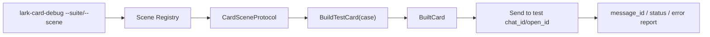

# BetaGo_v2 Card Regression Debug Design

## Scope

本文定义一套统一的“卡片回归发送”架构，目标是让仓库中的各类飞书卡片都能在脱离自然消息链路的情况下：

1. 被稳定构建。
2. 发送到指定测试 `chat_id` / `open_id`。
3. 被纳入可重复执行的回归场景。
4. 通过接口约束，强制每个卡片场景实现“构建测试卡片”的逻辑。

这里的“场景”指一条具备独立语义的发卡链路，例如：

- `config list` 配置面板
- `feature list` 功能开关面板
- `permission manage` 权限管理卡
- `ratelimit stats` 频控统计卡
- `schedule list/query` 管理卡
- `help` / `command form` 这类 schema v2 导航卡
- `wordcount` / `chunk` 查询卡
- `music` 搜索结果卡

命名约束：

- `scene key` 统一使用 `<domain>.<action>`。
- `case name` 只描述同一 scene 下的回归变体，例如 `smoke-default`、`live-default`、`sample-rich`。
- `sample` / `live` 不再作为 scene key 的一部分，而是 case tag 或 case name 的一部分。
- 旧的 `spec` 名称只保留为 CLI alias，不再作为 registry 主键。

建议的 canonical scene key：

- `config.list`
- `feature.list`
- `permission.manage`
- `ratelimit.stats`
- `schedule.list`
- `schedule.query`
- `help.view`
- `command.form`
- `wordcount.chunks`
- `wordchunk.detail`
- `music.list`

legacy spec alias 映射：

| Legacy `--spec` | Canonical scene key | Recommended default case |
| --- | --- | --- |
| `config` | `config.list` | `live-default` |
| `feature` | `feature.list` | `live-default` |
| `permission` | `permission.manage` | `live-default` |
| `ratelimit` | `ratelimit.stats` | `live-default` |
| `ratelimit.sample` | `ratelimit.stats` | `smoke-default` |
| `schedule.list` | `schedule.list` | `live-default` |
| `schedule.sample` | `schedule.list` | `smoke-default` |
| `schedule.task` | `schedule.query` | `live-default` |
| `wordcount.sample` | `wordcount.chunks` | `sample-default` |
| `chunk.sample` | `wordchunk.detail` | `sample-default` |

本文不覆盖：

- 飞书模板本身的视觉改造
- 回调触发后的业务正确性验证
- 截图比对、OCR 或视觉 diff

## Problem Statement

当前仓库已经具备一套 `carddebug` 能力，但它仍然有三个结构性问题：

1. `internal/application/lark/carddebug/card_debug.go` 通过 `switch` 分发 spec，新增场景时需要手动补 case，缺少统一注册协议。
2. 业务代码中的发卡链路大多仍然是“在 handler 内直接构卡然后直接发”，没有被编译期约束要求必须提供测试构卡能力。
3. 调试入口更偏向“临时手工发一张卡”，而不是“把所有场景作为可遍历、可发送、可回归的场景集合”。

结果是：

- 某些卡片有 debug spec，某些没有。
- 某些卡片只能靠自然消息触发，重构时很难人工回归。
- 新增卡片时，很容易忘记补调试入口或回归样例。

## Goals

- 为所有卡片场景定义统一的协议，至少包含“生产构卡”和“测试构卡”两个入口。
- 保留当前 `BuiltCard` 对 template / raw card JSON 的统一抽象，避免上层关心卡片方言。
- 支持一键把单个场景或整组回归场景发送到指定测试 `chat_id`。
- 支持 dry-run，仅构卡不发送，用于本地和 CI smoke test。
- 让新增卡片场景时，必须显式实现测试构卡逻辑，而不是事后补 `debug spec`。
- 提供渐进迁移路径，不要求一次性重写所有现有 handler。

## Non-Goals

- 不要求所有场景都必须依赖伪造数据；允许 live-data 场景，但必须声明依赖上下文。
- 不强制第一阶段就把所有 `sendCompatibleCard*` 全部删除；但要为此建立迁移方向和守卫。
- 不引入新的外部存储，只在 CLI / skill / registry 层组织回归流程。

## Existing Baseline

现状中已经存在可以复用的部件：

| Area | Existing Asset | Reuse Value |
| --- | --- | --- |
| 调试 CLI | `cmd/lark-card-debug` | 已支持发给 `chat_id` / `open_id` |
| 调试 skill | `.codex/skills/lark-card-debug` | 已可被开发代理直接调用 |
| 统一载体 | `carddebug.BuiltCard` | 已统一 template card / raw card JSON |
| 发送目标 | `carddebug.ReceiveTarget` | 已区分发送目标与业务上下文 |
| 现有样例 spec | `config` / `feature` / `schedule.*` / `ratelimit.*` / `wordcount.sample` / `chunk.sample` | 可作为第一批迁移对象 |

但缺少的核心是：

- 场景注册中心
- 编译期接口约束
- 面向“回归套件”而不是“单次调试”的执行器
- 针对“未纳入协议的直接发卡路径”的守卫测试

## Design Options

### Option A: 继续扩展 `carddebug` 的 `switch`

做法：继续在 `card_debug.go` 中增加 `SpecXxx` 常量和 `buildXxxCard` 方法。

优点：
- 改动最小。
- 现有 CLI 和 skill 复用成本低。

缺点：
- 没有接口约束。
- 无法强制业务场景提供测试构卡逻辑。
- 仍然是“补 spec”，不是“场景天然可回归”。

结论：不推荐。只能作为过渡，不适合作为最终结构。

### Option B: 引入“卡片场景协议 + 注册中心 + 回归执行器”

做法：
- 定义统一接口，让每个卡片场景都实现 `BuildCard` 和 `BuildTestCard`。
- 通过注册中心暴露给 debug CLI / regression runner。
- 新增守卫测试，限制未来继续绕开协议直接发卡。

优点：
- 有清晰的编译期约束。
- 能同时服务生产链路和回归链路。
- 适合渐进迁移。

缺点：
- 需要为现有高价值场景补适配层。
- 需要设计清楚“业务上下文”和“发送目标”的边界。

结论：推荐方案。

### Option C: 一次性把所有发卡路径都改写为统一 sender framework

做法：
- 禁止所有 handler 直接构卡和发送。
- 所有场景统一改成 `protocol.Build -> sender.Send`。

优点：
- 结构最纯粹。
- 约束最强。

缺点：
- 改造面过大。
- 风险高，容易与当前正在进行的其他重构冲突。

结论：作为 Option B 的远期终态，不适合第一阶段直接落地。

## Recommended Architecture

采用 Option B，并为 Option C 预留迁移路径。

核心思路：

1. 把“卡片场景”抽象成一等公民，而不是零散的 debug spec。
2. 把“发送目标”和“构卡上下文”继续严格分离。
3. 让调试 CLI、skill、手工回归、后续 CI smoke 都复用同一个场景注册表。
4. 通过接口和守卫测试，要求每个场景实现 `BuildTestCard`。

## Core Model

### 1. Unified Card Payload

沿用当前统一抽象，但从 `carddebug` 下沉到公共回归包：

```go
type BuiltCardMode string

const (
    BuiltCardModeTemplate BuiltCardMode = "template"
    BuiltCardModeCardJSON BuiltCardMode = "card_json"
)

type BuiltCard struct {
    Mode         BuiltCardMode
    Label        string
    TemplateID   string
    TemplateName string
    TemplateCard *larktpl.TemplateCardContent
    CardJSON     map[string]any
}
```

这保证了回归执行器不需要知道场景使用 template card 还是 schema v2 raw card。

### 2. Context Split

必须继续区分两类上下文：

```go
type ReceiveTarget struct {
    ReceiveIDType string // chat_id | open_id
    ReceiveID     string
}

type CardBusinessContext struct {
    ChatID       string
    ActorOpenID  string
    TargetOpenID string
    MessageID    string
    Scope        string
    ObjectID     string
}
```

说明：
- `ReceiveTarget` 决定“发给谁看”。
- `CardBusinessContext` 决定“卡是按什么业务身份和对象构建的”。

这和当前 `carddebug` 的设计一致，必须保留，避免“发给测试群”和“业务上下文群”被混淆。

### 3. Card Scene Protocol

每个发卡场景必须实现统一协议：

```go
type CardSceneProtocol interface {
    SceneKey() string
    Meta() CardSceneMeta

    // 生产构卡：给真实 handler / callback / tool 使用
    BuildCard(ctx context.Context, req CardBuildRequest) (*BuiltCard, error)

    // 暴露至少一组可回归 case
    TestCases() []CardRegressionCase

    // 测试构卡：给 debug CLI / regression runner 使用
    // runner 负责选 case、合并 args、校验 requirements；
    // scene 只负责基于“已解析后的 case request”构卡
    BuildTestCard(ctx context.Context, req TestCardBuildRequest) (*BuiltCard, error)
}
```

相关 DTO：

```go
type CardSceneMeta struct {
    Name        string
    Description string
    Tags        []string
    Owner       string
}

type CardBuildRequest struct {
    Business CardBusinessContext
    Args      map[string]string
}

type TestCardBuildRequest struct {
    Business CardBusinessContext
    Case      CardRegressionCase
    Args      map[string]string
    DryRun    bool
}

type CardRegressionCase struct {
    Name        string
    Description string
    Args        map[string]string
    Requires    CardRequirementSet
    Tags        []string
}
```

关键约束：
- `BuildTestCard` 是强制方法，不是 optional。
- `TestCases()` 不能为空；每个场景至少暴露一个回归 case。
- `BuildTestCard` 可以复用 `BuildCard`，但必须显式存在。

### 4. Requirement Contract

`CardRequirementSet` 必须是显式结构，而不是散落在字符串里：

```go
type CardRequirementSet struct {
    NeedBusinessChatID bool
    NeedActorOpenID    bool
    NeedTargetOpenID   bool
    NeedObjectID       bool
    NeedDB             bool
    NeedRedis          bool
    NeedExternalIO     bool
}
```

语义：
- `NeedBusinessChatID` 表示构卡依赖业务 `chat_id`，不是发送目标 `to_chat_id`。
- `NeedObjectID` 适用于 `schedule.query`、`wordchunk.detail` 这类需要显式对象 ID 的场景。
- `NeedExternalIO` 用于像 `music.list` 这类可能依赖上游接口调用的场景。

runner 与 scene 的职责边界：

1. runner 先根据 `scene key` 找到 scene。
2. runner 再根据 `case name` 从 `TestCases()` 里选中一个 case。
3. runner 合并参数，优先级为 `case.Args < CLI args`。
4. runner 校验 `CardRequirementSet`。
5. 校验通过后，runner 才调用 `BuildTestCard(...)`。

因此：
- requirement 校验是 runner 的职责。
- scene 负责构卡和业务语义校验，不负责 silent skip。

## Registry Design

新增场景注册中心：

```go
type SceneRegistry interface {
    Register(scene CardSceneProtocol)
    MustRegister(scene CardSceneProtocol)
    Get(sceneKey string) (CardSceneProtocol, bool)
    List() []CardSceneProtocol
}
```

用途：
- 替代 `carddebug.Build()` 里的 `switch`。
- 为 `debug card --scene=...` 和 `card regression run --scene=...` 提供统一发现入口。
- 为测试提供“遍历所有已注册场景”的能力。

### Registration Rule

每个场景在自己的业务包定义，但通过显式 wiring 注册，而不是依赖包级 `init()`：

- `config` 相关场景在 `internal/application/config`
- `schedule` 相关场景在 `internal/application/lark/schedule`
- `ratelimit` 场景在 `internal/application/lark/ratelimit`
- `help` / `command form` 场景在 `internal/application/lark/command`
- `wordcount` / `wordchunk` 场景在 `internal/application/lark/handlers`
- `music` 场景建议放在上层 handler 适配包，例如 `internal/application/lark/handlers/music_regression_scene.go`，而不是直接塞进 `neteaseapi` 的基础设施层

这样可以让“场景定义”和“构卡逻辑”共址，避免 debug 包重新维护业务细节。

## Regression Runner

建议在保留现有 `cmd/lark-card-debug` 的前提下，增加“回归模式”。实现上可选两种形式：

1. 扩展 `cmd/lark-card-debug`
2. 新建 `cmd/lark-card-regression`

推荐第一阶段先扩展现有 CLI，避免工具分裂。

### CLI Surface

建议新增：

```bash
go run ./cmd/lark-card-debug --list-scenes
go run ./cmd/lark-card-debug --scene schedule.list --case smoke-default --to-chat-id oc_xxx
go run ./cmd/lark-card-debug --suite smoke --to-chat-id oc_xxx
go run ./cmd/lark-card-debug --suite smoke --dry-run --report-json /tmp/card-regression.json
```

case 选择规则：

- `--scene` 模式下如果未传 `--case`，runner 默认选择 `smoke-default`。
- 如果该 scene 没有 `smoke-default`，runner 直接报错并列出可用 case，不做隐式猜测。
- live-data 回归必须显式传 `--case live-default` 或其它 live case 名称。

### Runner Flow



### Suite Types

至少支持三类：

- `smoke`: 仅运行带 `smoke` tag 的 case，默认 `--dry-run`，要求全部稳定构卡成功。
- `live-smoke`: 运行带 `live` tag 的 case；如果缺少 requirements，应输出 validation error，并在 report 中标记为 `validation_error`，但默认不导致进程退出失败。
- `send-smoke`: 在提供 `--to-chat-id` 后，发送所有带 `smoke` tag 的 case 到测试群。
- `scene:<name>`: 单场景回归。

退出码规则：

- `smoke`: 任一 case 构卡失败或发送失败，返回非零退出码。
- `send-smoke`: 任一 case 构卡失败或发送失败，返回非零退出码。
- `live-smoke`: 只有在 requirements 已满足但构卡/发送失败时，返回非零退出码；单纯缺少 live context 时返回零退出码，但 report 必须带出失败明细。

后续可扩展：
- `sample-only`
- `live-only`
- `tag:schema-v2`
- `tag:template`

## How Production and Regression Share the Same Contract

这是本文最关键的部分。

### Current Problem

当前很多链路是：

```go
card, err := BuildXXXCard(...)
if err != nil { ... }
return sendCompatibleCardJSON(ctx, data, metaData, card, suffix, false)
```

问题在于：
- 生产链路能发卡，但没有任何接口要求它必须可回归。
- `BuildXXXCard` 是否能被脱离消息链路地调用，没有被纳入协议。

### Proposed Rule

未来所有“卡片发送场景”都应该绑定一个 `CardSceneProtocol`，发送不再直接依赖裸 builder，而是依赖 scene：

```go
type SceneSender interface {
    SendSceneCard(ctx context.Context, target ReceiveTarget, scene CardSceneProtocol, req CardBuildRequest) error
}
```

在第一阶段，不强制所有现有 handler 立即改写；但要建立以下约束：

1. 新增卡片场景时，必须先定义 `CardSceneProtocol` 实现。
2. 旧场景只要进入回归治理范围，就必须补 `BuildTestCard`。
3. 第二阶段开始，新增 direct send helper 必须带 `sceneKey` 或 `CardSceneProtocol` 参数。
4. 第三阶段增加守卫测试，禁止在业务 handler 中新增未经注册的直接发卡路径。

## Guardrails

为了防止这套设计退化回“大家记得就补，不记得就算了”，需要自动化守卫。

### 1. Registry Smoke Test

```go
func TestAllRegisteredScenesCanBuildSmokeCase(t *testing.T)
```

断言：
- 所有已注册场景都有至少一个 case。
- 所有带 `smoke` tag 的 case 在 `dry-run` 模式下都能成功构卡。
- `BuiltCard` 非空，模式合法。

### 2. No Duplicate Scene Key Test

```go
func TestSceneRegistryNoDuplicateKeys(t *testing.T)
```

断言：
- `SceneKey()` 全局唯一。

### 3. Direct Send Guard Test

增加一个基于 `rg` 或 AST 的守卫测试，约束以下符号只能出现在允许的包里：

- `sendCompatibleCard(`
- `sendCompatibleCardJSON(`
- `sendCompatibleRawCard(`
- `larkmsg.CreateMsgCardWithResp(`
- `larkmsg.CreateCardJSON(`
- `larkmsg.CreateRawCard(`

allowlist 初期只包含：
- `internal/application/lark/carddebug`
- `internal/application/lark/cardregression`
- 少数仍在迁移中的兼容文件

目标不是马上清零，而是阻止新增绕行。

### 4. Scene Coverage Manifest Test

为高价值场景维护一份清单：

- `config.list`
- `feature.list`
- `permission.manage`
- `ratelimit.stats`
- `schedule.list`
- `schedule.query`
- `help.view`
- `command.form`
- `wordcount.chunks`
- `wordchunk.detail`
- `music.list`

测试断言这些 key 都必须已注册。

## Data Strategy for Test Cases

不是所有场景都适合只用 sample data，因此用双轨模型：

### Sample Cases

适用于：
- `ratelimit.stats` 的 `smoke-default`
- `schedule.list` 的 `smoke-default`
- `schedule.query` 的 `sample-default`
- `wordcount.chunks` 的 `sample-default`
- `wordchunk.detail` 的 `sample-default`
- `help.view`
- `command.form`

特点：
- 不依赖真实 DB 或线上状态。
- 能稳定用于 CI / 本地 smoke。

### Live Cases

适用于：
- `config.list`
- `feature.list`
- `permission.manage`
- `schedule.list`
- `schedule.query`
- 某些 music 搜索卡

特点：
- 依赖真实 `chat_id` / `actor_open_id` / `target_open_id` / `object_id`。
- 主要用于开发态或预发手工回归。

规则：
- 每个场景至少有一个 case。
- 每个要进入 `smoke` 套件的场景，至少要有一个带 `smoke` tag 的 case。
- live-only 场景允许存在，但不会自动进入 `smoke`；它们进入 `live-smoke` 或单场景运行。
- 如果 case 缺依赖，runner 必须输出显式 validation error，而不是 silent skip。

## Package Layout

推荐新增一个更明确的回归包，而不是继续把所有能力塞回 `carddebug`：

| Package | Responsibility |
| --- | --- |
| `internal/application/lark/cardregression` | 场景协议、注册中心、suite runner、守卫测试 |
| `internal/application/lark/carddebug` | CLI/debug 适配层，继续支持单卡调试和 legacy spec alias |
| 各业务包 | 定义自己的 `CardSceneProtocol`，通常以 `*_regression_scene.go` 存放 |
| `cmd/lark-card-debug` wiring | 统一装配 registry，显式注册场景 |

建议的文件结构：

- `internal/application/lark/cardregression/protocol.go`
- `internal/application/lark/cardregression/registry.go`
- `internal/application/lark/cardregression/runner.go`
- `internal/application/lark/cardregression/guard_test.go`
- `internal/application/lark/cardregression/registry_test.go`
- `internal/application/lark/cardregression/runner_test.go`
- `internal/application/config/card_regression_scene.go`
- `internal/application/permission/card_regression_scene.go`
- `internal/application/lark/ratelimit/card_regression_scene.go`
- `internal/application/lark/schedule/card_regression_scene.go`
- `internal/application/lark/command/card_regression_scene.go`
- `internal/application/lark/handlers/wordcount_regression_scene.go`
- `internal/application/lark/handlers/wordchunk_regression_scene.go`
- `internal/application/lark/handlers/music_regression_scene.go`

## Migration Strategy

### Phase 1: Build the Spine

- 引入 `CardSceneProtocol`、`SceneRegistry`、runner。
- 保留现有 `carddebug` CLI，但在 registry 覆盖完整前，先保持 `switch fallback`，避免当前 debug surface 中断。
- 先迁移已有 `carddebug` spec 对应的 canonical scene / alias：
  - `config.list` (`config`)
  - `feature.list` (`feature`)
  - `permission.manage` (`permission`)
  - `ratelimit.stats` (`ratelimit`, `ratelimit.sample`)
  - `schedule.list` (`schedule.list`, `schedule.sample`)
  - `schedule.query` (`schedule.task`)
  - `wordcount.chunks` (`wordcount.sample`)
  - `wordchunk.detail` (`chunk.sample`)

### Phase 2: Cover High-Value Interactive Cards

优先补这些目前重要但未统一纳入回归协议的卡：

- `help.view`
- `command.form`
- `wordcount.chunks`
- `wordchunk.detail`
- `music.list`

### Phase 3: Add Guardrails

- 加 `TestAllRegisteredScenesCanBuildSmokeCase`
- 加 direct send allowlist 测试
- 在 README / skill 中把 `--scene` / `--suite` 用法补齐

### Phase 4: Tighten Production Contract

- 新增卡片场景必须走 `CardSceneProtocol`
- 逐步让 send helper 带 scene 参数
- 收口旧的“匿名构卡 + 直接发送”模式

## Error Handling

Runner 必须输出结构化结果：

```go
type RegressionResult struct {
    SceneKey   string
    CaseName   string
    Built      bool
    Sent       bool
    MessageID  string
    Error      string
    StartedAt  time.Time
    FinishedAt time.Time
}
```

失败语义：
- 构卡失败：标记 `Built=false`，不中止整个 suite，除非 `--fail-fast`。
- 发送失败：标记 `Sent=false`，保留已构建 payload 信息。
- 缺依赖：输出显式 validation error，例如 `business chat_id is required for config.list/live-default`。

## Testing Strategy

### Unit

- protocol / registry
- duplicate scene key
- smoke build for all sample scenes
- runner report aggregation
- scene requirement validation

### Integration

- `--scene <key> --dry-run`
- `--suite smoke --dry-run`
- `--scene schedule.list --to-chat-id oc_xxx --chat-id oc_ctx`

### Manual Regression

推荐人工回归流：

1. 开发前先跑 `--suite smoke --dry-run`，确认 registry 未破。
2. 修改某个场景后，跑 `--scene <key> --to-chat-id <test_chat>` 发到测试群。
3. 对依赖真实业务数据的场景，再跑 `--suite live-smoke ...` 或 `--scene <key> --case live-default ...`。
4. 大改前后，再跑一次 `--suite send-smoke --to-chat-id <test_chat>` 看整组 smoke 卡片是否都能发出。

## Risks

- 如果第一阶段就试图让所有 handler 都切换到统一 sender，改造面会过大。
- 某些 live-data 场景会依赖真实 DB / 权限 / 业务对象，必须允许声明依赖而不是强行 sample 化。
- `music` 这类卡片可能还混有 template 和多步上传链路，适配时要把“发送歌曲资源”和“构建列表卡”分开建模。

## Decisions

- 采用“场景协议 + 注册中心 + 回归执行器”的结构，而不是继续扩展 `switch`。
- 把“测试构卡”定义为接口强制方法，作为卡片场景的准入条件。
- 第一阶段复用现有 `lark-card-debug` CLI，而不是马上拆出独立二进制。
- 用守卫测试阻止未来新增绕开协议的 direct send 路径。

## Open Questions

这些问题不阻塞文档落地，但实现时要定稿：

1. `music.list` 的 regression case 是否默认只验证列表卡，不触发后续播放上传链路。
2. `music.list` 的 live case 是否需要拆成 `api-live` 与 `upload-live` 两层。
3. direct send allowlist 测试使用 AST 还是 `rg`；第一阶段建议用 `rg`，实现成本更低。
