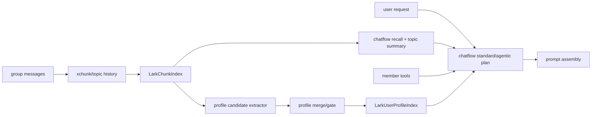

# BetaGo_v2 Chatflow User Context Augmentation Design

## Scope

本文定义一套面向当前 `agentruntime/chatflow` 主链路的“人物/群态上下文增强”设计。目标是在不推翻现有运行时与工具体系的前提下，平衡两件事：

1. 避免长期记忆污染即时回复（上下文污染）。
2. 让机器人在群聊中具备稳定、自然的连续性（长期记忆融入性）。

本文覆盖：

- 基于当前代码结构的架构重定位（从旧 `chat_handler` 假设迁移到 `chatflow`）。
- 索引隔离、冷启动回扫、在线按需召回三段式方案。
- `standard_plan` 与 `agentic_plan` 下的差异化读取策略。
- 工具调用边界与审批安全。
- 渐进上线和评估闭环。

本文不覆盖：

- 跨群统一身份图谱。
- 敏感属性与高风险标签推断。
- 对 `xchunk` 或 `agentruntime` 做破坏性重写。

Related docs:

- `docs/architecture/agent-runtime-design.md`
- `docs/architecture/agent-runtime-plan.md`
- `docs/architecture/group-user-profile-memory-design.md` (superseded)
- `docs/architecture/group-user-profile-memory-plan.md` (superseded)

## Why We Need A New Version

旧版“group user profile memory”设计仍有价值，但其主链路假设已过时：

- 当前核心对话装配在 `internal/application/lark/agentruntime/chatflow/*`。
- prompt 由 `standard_plan.go` / `agentic_plan.go` 中的构建器直接生成，不再以旧模板注入为中心。
- 新工具能力（例如 `get_chat_members`、`get_recent_active_members`、`finance_tool_discover`）已成为上下文获取主手段。
- `toolmeta/runtime_behavior.go` 已形成工具副作用与审批边界的统一约束。

因此，新的设计不再把“画像存储”视为唯一入口，而是改为“多源上下文增强”的一层能力，其中长期画像是可选、受控、按需融入的子模块。

## Design Principles

1. **索引隔离，不语义混存**  
   `topic/history` 与 `user/profile` 分离存储；避免检索混淆。

2. **默认不注入，按需读取**  
   用户画像不常驻 prompt；仅在目标明确、价值明确时注入。

3. **工具优先，记忆兜底**  
   实时成员信息优先通过工具获取；长期记忆用于补足“稳定特征”。

4. **线程优先，群级次之，长期最末**  
   回复线程上下文优先级最高，最近历史其次，长期画像最后。

5. **审批与副作用边界前置**  
   读取画像是低风险读能力；写入/修正规则受治理约束，避免暗中扩写。

## Recommended Architecture

分层职责：

- `Chunk/Topic Layer`: 负责“在聊什么”。
- `Member Tool Layer`: 负责“谁在群里、谁最近活跃”。
- `Profile Layer`: 负责“某人在该群长期稳定表现”。
- `Prompt Assembly`: 负责按优先级和预算合并，不直接暴露全量长期记忆。

## Context Read Strategy

### Standard Plan (`standard_plan.go`)

适用于快速单轮回复。读取顺序建议：

1. reply-scoped 上下文（如存在）。
2. 最近历史（严格条数上限）。
3. 必要时调用成员工具（点名/确认对象场景）。
4. 仅在触发条件满足时，补充少量画像片段（1~3 条）。

触发条件（建议全部满足）：

- 明确目标用户（当前发言者或被提及者）。
- 问题与“偏好/角色/历史职责”相关。
- 近期上下文不足以支撑回答。

### Agentic Plan (`agentic_plan.go`)

适用于多轮工具协作。策略：

- 在 plan 阶段允许“先工具后记忆”：先 `get_chat_members` / `get_recent_active_members` 再决定是否取画像。
- 画像读取应作为显式 capability（read-only），并遵守轮次预算与输出截断。
- 当 run 在 reply thread 内时，优先继承 thread context，降低长期画像权重。

## Pollution Control (核心平衡机制)

1. **隔离检索**  
   Topic 搜索不命中 profile index；profile 检索不回灌 topic recall。

2. **片段预算**  
   每轮画像片段上限（建议 3 条）；单条长度与总 token 均设阈值。

3. **证据门禁**  
   画像写入必须具备最小证据（多次出现或跨时间窗稳定）。

4. **冲突优先级**  
   新近线程事实 > 最近历史 > 长期画像。

5. **显式不确定性**  
   置信度低的画像不注入；必要时让模型通过工具二次确认。

6. **衰减与失效**  
   长期未被验证的画像自动降权，避免陈旧信息污染。

## Cold-Start Backfill (历史回扫)

回扫作为冷启动流程，不阻塞在线链路：

1. 从既有 chunk/topic 索引分批扫描候选证据。
2. 先 dry-run 产出“候选画像 + 置信度 + 覆盖率”报告。
3. 人工抽样评估后再写入 profile index。
4. 上线后以低频增量回扫维持新老数据平衡。

回扫本身也是评估机会：

- 观察噪声画像占比。
- 评估注入前后回复质量变化。
- 调整 facet 白名单与写入阈值。

## Runtime Safety And Governance

结合 `toolmeta/runtime_behavior.go` 的约束：

- Profile 读取能力定义为 `SideEffectLevelNone`。
- Profile 写入/纠错若引入工具化入口，默认走审批或严格白名单。
- 永远不让高副作用工具依赖未经治理的画像写入链路。

## Rollout Strategy

1. **Phase 0: 观测就绪**  
   只打日志和指标，不改 prompt。

2. **Phase 1: 只读注入灰度**  
   小流量开启画像读取；默认仍以 thread/history/tool 为主。

3. **Phase 2: 冷启动回扫上线**  
   执行 dry-run -> 抽样评估 -> 小批写入。

4. **Phase 3: 在线写入灰度**  
   开启增量写入与衰减任务，持续监控污染率。

5. **Phase 4: 常态化治理**  
   每周校准阈值、修正规则、回滚开关验证。

## Success Metrics

- 回复污染率下降：因“陈旧画像”导致的明显误答比例下降。
- 融入性提升：跨天会话中对成员角色/偏好的延续性提升。
- 工具依赖健康：成员信息更多来自实时工具，画像作为补充而非替代。
- 可回退性：任一阶段关闭画像开关后，`chatflow` 主链路稳定无回归。

## Compatibility Notes

- 旧文档中的“索引隔离 + 历史回扫”原则保留并升级。
- 新设计将“用户画像”从单体功能改为“上下文增强体系”的一层。
- 现阶段不建议继续把实现绑定在旧 `chat_handler` 路径上。
