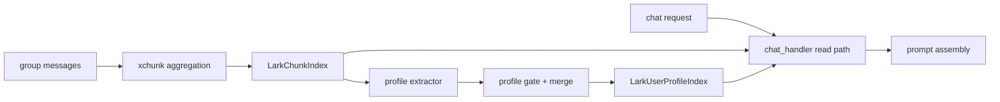

# BetaGo_v2 Group User Profile Memory Design

## Scope

本文定义一套面向群聊 LLM 机器人的“用户画像长期记忆”设计，目标是在不推翻现有群消息聚合、chunk 摘要、历史召回链路的前提下，为机器人增加一层低污染、可治理、可冷启动的 `chat_user` 画像记忆。

本文覆盖：

1. 为什么不能把用户画像直接混入现有 chunk/topic 记忆。
2. 为什么第一阶段推荐“索引隔离 + 冷启动回扫 + 按需召回”。
3. 用户画像的作用域、数据模型、状态机和证据约束应该是什么。
4. 在线写入链路、离线冷启动回扫链路、在线读取链路如何配合。
5. 如何控制“上下文污染”与“长期记忆融入感”之间的平衡。
6. 如何做衰减、纠错、回滚、评估和渐进上线。

本文不覆盖：

- 全局跨群统一身份图谱。
- 敏感属性存储或人格/心理标签推断。
- 对现有聊天主链进行大规模重构。
- 直接从原始消息表重建一整套新记忆系统。

Related docs:

- `docs/architecture/qqbot-group-message-plan.md`
- `docs/permission_scope_constraints.md`
- `docs/adr/0003-config-access.md`
- `docs/architecture/agent-runtime-design.md`

## Problem Statement

群聊机器人的长期记忆存在两个天然冲突：

- 如果什么都不记，机器人会显得没有连续性，无法自然延续群内分工、偏好和历史共识。
- 如果什么都往长期记忆里塞，群聊中的噪声、玩笑、临时状态和多方冲突会快速污染后续回复。

当前系统已经有一条相对稳的群聊历史链路：

- 原始消息进入 `pkg/xchunk/chunking.go`
- 系统按时间窗或大小阈值聚合消息
- 大模型生成结构化 chunk 摘要
- chunk embedding 写入 `LarkChunkIndex`
- 聊天读路径在 `internal/application/lark/handlers/chat_handler.go` 中同时使用近期历史、召回文档和 topic 摘要

这条链路已经很好地解决了“近期上下文”和“话题级历史”的问题，但它还没有解决“这个人在当前群里长期呈现出什么稳定特征”的问题。

如果直接把用户画像混进现有 chunk 索引，会立刻带来三个问题：

1. `topic memory` 和 `profile memory` 语义混杂，检索时难以做边界控制。
2. 机器人会更容易把“这段在聊什么”误当成“这个人是什么样的人”。
3. 用户画像会更倾向于常驻 prompt，而不是按需注入，导致上下文污染。

因此，第一阶段不应该重写现有 chunk 体系，而应该在现有体系旁边增加一个平行的用户画像记忆层。

## Existing Baseline

当前仓库中已经有三块可以直接复用的基础设施。

### 1. Chunk 聚合与结构化摘要

`pkg/xchunk/chunking.go` 已经提供：

- 群消息时间窗聚合
- 去重与超时合并
- 结构化 chunk 摘要生成
- embedding 计算
- OpenSearch 写入

这意味着第一阶段不需要从原始消息重新做一次“消息压缩”。

### 2. 聊天读路径已有多源上下文装配

`internal/application/lark/handlers/chat_handler.go` 当前会组装：

- `HistoryRecords`
- `Context`
- `Topics`

这说明现有读路径已经接受“多种上下文源并存”的模型，后续新增 `UserProfiles` 不需要推翻模板结构，只需要加一类按需注入的数据。

### 3. Scope 设计已经存在

`docs/permission_scope_constraints.md` 与 `docs/adr/0003-config-access.md` 已经明确了：

- `global`
- `chat`
- `user`
- `chat_user`

这些 scope 边界的存在，使用户画像第一阶段默认落在 `chat_user` 成为自然选择。

### Current Gaps

虽然 `internal/xmodel/models.go` 中的 `MessageChunkLogV3` 已经预留了 `OpenIDs` 等字段，但当前 chunk 落库仍更偏向“话题摘要”，缺少足够稳定的说话人证据来支撑用户画像提取。

具体来说，第一阶段要补的不是新的聊天主链，而是：

- 更稳定的 chunk 参与者信息
- 更明确的用户画像候选提取链路
- 更严格的画像写入 gate 和读取 gate

## Design Options

### Option A: 直接在 `LarkChunkIndex` 中混入用户画像字段

做法：

- 继续使用现有 chunk index
- 在 chunk 文档中增加画像字段
- 检索时同时拿 topic 和记忆

优点：

- 改动最小
- 不需要额外索引

缺点：

- 语义边界不清
- topic recall 和 profile recall 会互相污染
- prompt 注入更难节制

结论：不推荐。

### Option B: 新增独立 `UserProfile` 索引，保留 chunk 主链不变

做法：

- chunk index 继续只承载话题级记忆
- 新增 `LarkUserProfileIndex`
- chunk 成功落库后异步提取画像候选
- 冷启动阶段从历史 chunk 回扫
- 在线读路径仅在需要时召回画像

优点：

- 索引隔离清晰
- 写入和读取 gate 容易治理
- 回退成本低
- 符合现有架构的保守演进路径

缺点：

- 需要新增索引、提取器和回扫作业
- 需要补强 chunk 证据层

结论：推荐方案。

### Option C: 直接做 canonical profile DB，OpenSearch 只做证据检索

做法：

- 建一套独立 profile store
- 搜索索引只存证据，不直接存画像

优点：

- 长期最纯粹
- 更适合未来复杂治理

缺点：

- 第一阶段成本过高
- 与现有系统脱节

结论：作为后续演进方向保留，不适合当前阶段。

## Recommended Architecture

采用 Option B，并明确三条分层原则：

1. `chunk memory` 负责“这段群聊聊了什么”。
2. `profile memory` 负责“这个人在当前群里稳定呈现出什么特征”。
3. `prompt` 只按需读取 profile memory，不让它常驻。

整体结构如下：



这里最关键的约束是：

- 不改 chunk index 的核心职责
- 不把 profile memory 混成 chunk 的附属字段
- profile recall 只在需要时发生

## Scope And Identity Model

第一阶段用户画像默认采用 `chat_user` scope。

原因：

- 同一个人在不同群里的角色、职责和沟通风格可能不同。
- 直接做 `user` 级全局画像，容易把某群中的标签错误迁移到另一个群。
- `chat_user` 更符合“群聊中长期融入”的产品目标。

推荐 identity 维度：

- `app_id`
- `bot_open_id`
- `scope`
- `chat_id`
- `user_id`

文档主键建议为：

`app_id:bot_open_id:chat_id:user_id:facet:canonical_value_hash`

如果未来需要支持提升为 `user` scope：

- 不覆盖原 `chat_user`
- 而是新建更高 scope 的 profile 文档
- 由多个 `chat_user` 证据汇聚后再提升

## Profile Data Model

用户画像文档建议如下：

```json
{
  "id": "app_id:bot_open_id:chat_id:user_id:facet:canonical_value_hash",
  "app_id": "...",
  "bot_open_id": "...",
  "scope": "chat_user",
  "chat_id": "...",
  "user_id": "...",

  "facet": "role|expertise|communication_preference|stable_interest|collaboration_pattern",
  "canonical_value": "...",
  "aliases": ["..."],

  "confidence": 0.82,
  "evidence_count": 4,
  "origin": "self_claimed|observed|third_party|derived",
  "status": "candidate|active|stale|conflicted|retracted",

  "first_observed_at": "2026-03-20T10:00:00+08:00",
  "last_confirmed_at": "2026-03-23T09:00:00+08:00",
  "expires_at": "2026-06-23T09:00:00+08:00",

  "source_chunk_ids": ["..."],
  "source_msg_ids": ["..."],
  "summary_evidence": [
    "本人明确说主要负责后端链路",
    "多次被群内讨论默认指派为发布 owner"
  ]
}
```

第一阶段只允许以下 facet：

- `role`
- `expertise`
- `communication_preference`
- `stable_interest`
- `collaboration_pattern`

第一阶段明确禁止：

- 情绪状态
- 短期立场
- 玩笑和调侃形成的标签
- 诊断式人格推断
- 敏感属性
- 第三方负面评价

## Chunk Evidence Requirements

在开始 profile extraction 前，需要先补强 chunk 文档的证据层。

推荐在现有 `MessageChunkLogV3` 周边新增或稳定写入：

- `participants`
- `message_authors`
- `speaker_turns`

目标不是让 prompt 变大，而是让画像提取和冷启动回扫有足够可靠的证据。

推荐要求：

- 每个 chunk 至少能知道有哪些用户参与
- 最好能知道每条 `msg_id` 对应的 `user_id`
- 如果用户身份不确定，该 chunk 不能用于画像提取

这一步是第一阶段最重要的技术前置条件。

## Online Write Path

在线写入链路应该保持“主链稳定、支路异步”。

### Step 1: 保留当前 chunk 主链

当前 `pkg/xchunk/chunking.go` 的消息聚合、摘要、embedding 和写入逻辑继续保留，不因为画像需求改变其职责。

### Step 2: chunk 成功写入后触发异步 extractor

新增 `profile extractor`，输入为单个 chunk 文档，输出为若干“候选画像事实”。

输出示例：

```json
{
  "chat_id": "...",
  "user_id": "...",
  "facet": "role",
  "canonical_value": "负责发布流程",
  "origin": "observed",
  "confidence": 0.56,
  "evidence_count": 1,
  "source_chunk_ids": ["chunk-1"],
  "source_msg_ids": ["msg-1", "msg-2"],
  "summary_evidence": ["多次被点名处理发布", "本人回应会跟进发布"],
  "status": "candidate"
}
```

### Step 3: 候选画像先过 gate

只有通过 gate 的候选画像，才能进入持久层。

允许通过的典型信号：

- 本人明确自述
- 多个 chunk 中重复出现的稳定观察
- 他人描述且被本人确认

默认拒绝的信号：

- 一次性的情绪表达
- 临时任务状态
- 只有单次第三方描述、没有任何确认
- 带明显调侃、讽刺语气的归因

### Step 4: merge / upsert

同一 `chat_id + user_id + facet` 下：

- 语义一致的值合并证据、提升置信度
- 语义冲突的值不直接覆盖
- 新值先以 `candidate` 或 `conflicted` 进入
- 达到阈值后再成为 `active`

### Confidence Heuristics

第一阶段推荐以规则分为主：

- `self_claimed`: `0.70`
- `observed`: `0.45`
- `third_party`: `0.25`
- 每多一个独立 chunk 证据：`+0.10`
- 再次被本人确认：`+0.15`
- 出现冲突证据：`-0.20`

不建议第一阶段直接把模型打分作为最终置信度。

## Cold-Start Backfill

冷启动回扫是第一阶段的重要组成部分，但它应该被视为“初始化和评估流程”，而不是长期驻留在线路径的重作业。

### Backfill Source

冷启动只扫描现有 `LarkChunkIndex`，不直接扫描原始消息表。

原因：

- chunk 已经完成过一轮消息压缩
- chunk 更适合提炼稳定事实
- 能与在线 extractor 共享更多逻辑

### Backfill Scope

建议首轮范围：

- 最近 `30-90` 天
- 按 `chat_id` 分批处理
- 仅面向高活跃群优先回扫

### Backfill Output

冷启动默认只产出：

- `candidate`
- 小部分高置信度 `active`

不建议一上来就把大批候选都标成 `active`。

### Shared Logic

冷启动和在线写入必须复用同一套：

- facet 限制
- gate 规则
- merge / upsert 逻辑
- 状态流转规则

否则离线和在线会产生两套互相冲突的记忆语义。

## Offline Evaluation

冷启动回扫不应“扫完即上线”，而应先作为效果评估过程。

推荐从 `10-20` 个高活跃群中抽样，人工标注候选画像，评估以下指标：

- `precision`
- `over_generalization_rate`
- `contamination_rate`
- `coverage`

第一阶段建议目标：

- `precision >= 0.80`
- `contamination_rate <= 0.10`
- `coverage` 不作为硬门槛

原因是长期记忆系统第一阶段应优先“少错”，再追求“多记”。

建议额外产出两类离线产物：

- `backfill report`
- `golden cases`

`golden cases` 用于后续修改 extractor prompt、gate 或 merge 逻辑时做回归验证。

## Online Read Path

用户画像的核心原则是：`可召回，但不常驻`。

### Step 1: 先判断是否需要画像

只有下列情况才触发画像读取：

- 当前消息明确在问某个人
- 当前消息 `@` 了某个人，且问题和其职责/能力/偏好有关
- 当前轮需要做 owner 或角色推断
- 当前讨论明确在延续“某人之前负责什么、偏好什么”的语境

默认不触发：

- 泛泛闲聊
- 普通问答
- 与人物无关的工具请求

### Step 2: 先解析目标人，再查画像

目标解析优先级：

1. 明确 `@` 的用户
2. 文本里点名的用户
3. 当前说话人自己
4. 否则不查画像

### Step 3: 约束查询范围

查询时至少过滤：

- `app_id`
- `bot_open_id`
- `scope = chat_user`
- `chat_id`
- `user_id`
- `status in (active, stale)`

### Step 4: 小剂量召回

第一阶段每个目标用户只取 `1-3` 条画像事实。

推荐排序因子：

- `confidence`
- `last_confirmed_at`
- `evidence_count`
- `facet_relevance`

### Step 5: 以“可能相关事实”形式注入 prompt

推荐将画像注入为单独区块，而不是混入 system prompt：

```text
Potentially relevant user profile facts:
- [high confidence] 在当前群里，A 通常负责发布流程。
- [medium confidence] A 更偏好直接、简短的协作沟通。
Use these only if directly relevant to the current request.
If uncertain, ignore them.
```

这一步的关键约束：

- 不要求模型必须使用画像
- 不允许模型为了展示连续性而主动引用画像
- 低置信度画像只能作为弱信号

## Product-Level Reply Guidance

良好的“融入感”应该表现为：

- 需要时自然引用历史分工或偏好
- 不需要时完全不展示自己“记得很多”

推荐的回复风格：

- “如果还是按你们之前的分工，A 更像这块的 owner。”
- “按这个群里之前的讨论，A 这部分更偏向后端链路。”

不推荐的回复风格：

- “我记得 A 是一个偏爱直接沟通、擅长后端、经常负责发布的人。”

前者是按需融入，后者是长期记忆的表演化使用。

## Decay, Conflict And Correction

用户画像一旦落入长期记忆，真正风险不是“记不住”，而是“记错了还不断强化”。

因此需要明确治理规则。

### Decay

不同 facet 应有不同 TTL：

- `role` / `expertise`：较长 TTL
- `communication_preference` / `collaboration_pattern`：中等 TTL
- `stable_interest`：可保留较长时间，但长期不命中应逐步降权

长期不命中的画像应逐步降为 `stale`，而不是永久保持 `active`。

### Confirmation

被读取不等于被确认。

只有出现新的支持证据时，才更新：

- `last_confirmed_at`
- `confidence`

### Conflict

出现冲突证据时：

- 不做“最后写入覆盖”
- 新值先进入 `candidate` 或 `conflicted`
- 旧值降权
- 只有新值积累足够证据后，才替换 `active`

### Retraction

显式纠错优先级最高。

例如：

- “这不是我负责的”
- “不要记这个”
- “之前那个说法已经过期”

这类输入应直接触发：

- `retracted`
- tombstone
- 或旧画像快速退出主召回

## Config And Schema Changes

第一阶段建议新增：

- `OpensearchConfig.LarkUserProfileIndex`
- 对应 config key / accessor
- profile 文档 mapping

第一阶段建议补强：

- chunk 文档中的参与者证据字段
- 画像 extraction / merge / read 的 feature flag

第一阶段不建议：

- 为每个群单独创建索引
- 直接引入新的 profile DB

推荐方式是：

- 一个逻辑独立的 `UserProfile` 索引
- 文档级携带 `app_id + bot_open_id + chat_id + user_id`
- 必要时使用 alias 做 bot 级隔离

## Rollout Plan

### Phase 0: Design And Guardrails

- 完成本设计文档
- 明确 facet 白名单和禁区
- 明确评估指标

### Phase 1: Chunk Evidence Hardening

- 补强 chunk 文档中的参与者与说话人证据
- 确保画像提取可以稳定定位 `user_id`

### Phase 2: Profile Index And Backfill

- 新增 `LarkUserProfileIndex`
- 开发冷启动回扫作业
- 产出 `candidate profile`
- 生成人工评估报告

### Phase 3: Online Profile Writer

- chunk 成功落库后异步触发 extractor
- 进入 `candidate -> gate -> merge/upsert`

### Phase 4: Gated Online Reader

- 在 `chat_handler` 读路径中新增 `UserProfiles`
- 默认 feature flag 关闭
- 仅对白名单群开启

### Phase 5: Wider Rollout

- 根据离线与灰度指标逐步放量
- 调整 facet、阈值、衰减策略

## Acceptance Criteria

第一阶段的验收标准如下：

- 现有 chunk recall 行为不被破坏。
- 用户画像只在“问人、问分工、问偏好、问 owner”类场景中出现。
- 普通闲聊回复几乎不受画像注入影响。
- 冷启动离线评估满足目标阈值。
- 显式纠错后，旧画像可在可接受时间内退出主召回。
- profile recall 不显著拖慢当前聊天回复链路。

## Open Questions

以下问题保留到实现阶段进一步确认：

1. `MessageChunkLogV3` 中的用户证据字段是直接扩展，还是单独建 extractor 专用文档。
2. 画像提取是纯规则优先，还是“规则 + 轻量模型抽取”混合。
3. 是否需要在后续阶段增加 `user` scope 提升链路。
4. 是否需要给运营或管理员开放画像调试/撤销入口。

## Final Recommendation

对于群聊场景下的用户画像长期记忆，最稳妥的第一阶段方案是：

- 保留现有 chunk 主链和 topic recall
- 新增独立 `UserProfile` 索引
- 默认作用域为 `chat_user`
- 通过 chunk 证据生成候选画像
- 使用冷启动回扫验证策略效果
- 仅在人物相关问题中按需召回 `1-3` 条画像事实

这样可以在不推翻现有设计的前提下，把“长期记忆融入感”建立在可控、可解释、可撤销的用户画像之上，而不是把群聊噪声直接变成机器人常驻上下文。
