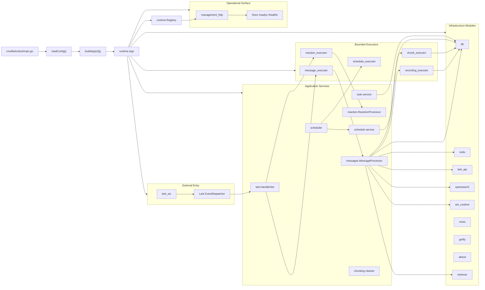
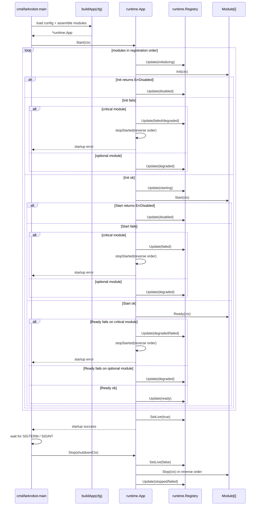
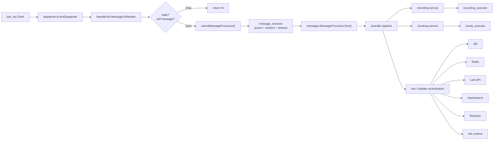
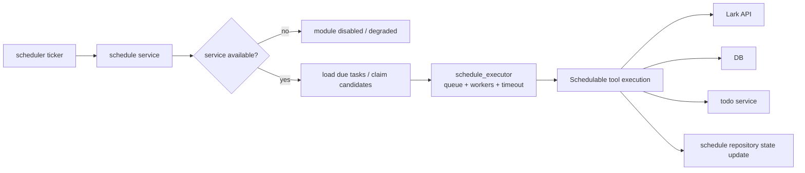
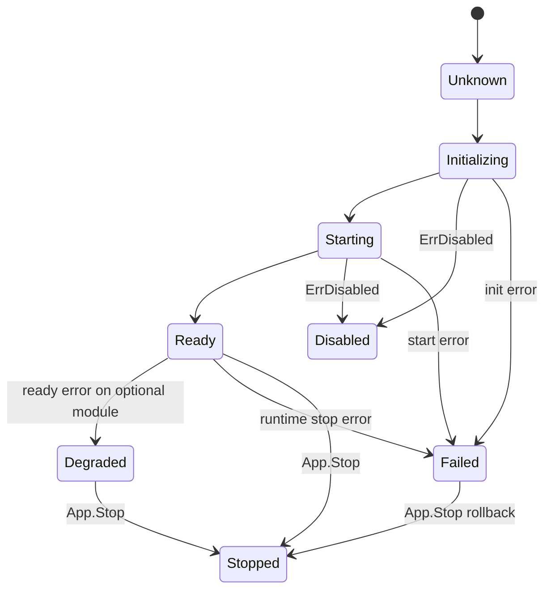

# BetaGo_v2 Current Runtime Refactor Design

## Scope
This document describes the runtime architecture that exists in the repository after the current治理改造, not just the target governance principles.

It focuses on four concrete questions:

1. How `cmd/larkrobot` boots and shuts down the process now.
2. How runtime modules, health reporting and degradation semantics are organized.
3. How Lark websocket ingress is routed into bounded background execution.
4. How scheduler and management surfaces fit into the runtime.

Related governance / policy docs:

- `docs/architecture/runtime-governance.md`
- `docs/architecture/runtime-refactor-plan.md`
- `docs/adr/0001-runtime-lifecycle.md`
- `docs/adr/0005-health-and-degradation.md`

## Design Goals Captured by the Current Refactor

- Replace scattered startup side effects with a single lifecycle container.
- Make critical vs optional dependency semantics explicit.
- Bound the highest-risk asynchronous entry points with worker pools and queue limits.
- Expose process-level liveness, readiness and per-component status.
- Keep the refactor incremental so existing application packages can remain mostly unchanged.

## Code Map

| Area | Primary Files | Responsibility |
| --- | --- | --- |
| Process entrypoint | `cmd/larkrobot/main.go` | Load config, compose modules, start/stop the runtime app |
| Lifecycle contract | `internal/runtime/module.go` | `Module` interface, `FuncModule` adapter, panic-to-error bridge |
| Runtime container | `internal/runtime/app.go` | Ordered startup, rollback, reverse-order shutdown |
| Health registry | `internal/runtime/health.go` | In-memory component states and readiness aggregation |
| Management HTTP | `internal/runtime/health_http.go` | `/livez`, `/readyz`, `/healthz`, `/statusz` |
| Bounded workers | `internal/runtime/executor.go` | Background queue, worker budget, task timeout, counters |
| WS ingress module | `internal/runtime/lark_ws.go` | Lark websocket client lifecycle wrapper |
| Runtime defaults | `internal/runtime/settings.go` | Shutdown timeouts and executor defaults |
| Lark transport ingress | `internal/interfaces/lark/handler.go` | Event edge checks and executor submission |

## Overall Runtime Topology

## Lifecycle and Startup Sequence

The runtime now has one explicit container, `runtime.App`, which owns startup order, rollback and shutdown order.

## Current Module Ordering

`buildApp(cfg)` currently registers modules in this order:

1. `otel`
2. `logging`
3. `db`
4. `redis`
5. optional infra adapters: `lark_api`, `opensearch`, `ark_runtime`, `minio`, `gotify`, `aktool`, `xhttp`, `netease_music`, `retriever`
6. bounded executors: `message_executor`, `reaction_executor`, `recording_executor`, `chunk_executor`, `schedule_executor`
7. `application_services`
8. `chunking`
9. `management_http`
10. `scheduler`
11. `lark_ws`

This ordering encodes several runtime invariants:

- DB and Redis must be available before application services are initialized.
- Executors must be started before transport ingress can submit work.
- Management HTTP should already be bound when websocket ingress begins receiving traffic.
- Scheduler should start only after schedule service and schedule executor exist.
- Lark websocket ingress is the last critical module so the runtime is already operational when events arrive.

## Message Ingress and Bounded Execution

The main websocket message path is now explicitly budgeted.

### Important semantics at the ingress edge

- `HandlerSet` performs only lightweight transport-edge checks before enqueueing work.
- `context.WithoutCancel` is used before submission so business processing is governed by executor timeout, not by the shorter-lived websocket callback context.
- `Submit()` fails fast when the queue is full; it does not block indefinitely and it does not spawn a fallback goroutine.
- The nil-executor path remains only as a legacy/test fallback. Production wiring in `buildApp` provides concrete executors.

## Reaction and Card Action Paths

- Reaction events follow the same structure as message ingress, but use `reaction_executor`.
- Card actions remain synchronous because the Lark callback expects an immediate response payload.
- Card action audit logging is still a best-effort fire-and-forget path and remains one of the known exceptions to the runtime executor model.

## Scheduler Path

The scheduler remains process-local today, but its execution path is now separated from ingress via a dedicated executor.

### Scheduler semantics

- Startup is skipped if the schedule service is unavailable.
- Actual task execution is budgeted by `schedule_executor`, so a burst of due tasks cannot create unbounded goroutines.
- Shutdown stops the scheduler before DB/Redis modules are torn down.
- The current implementation is still single-process oriented; ADR `0004-scheduler-ha.md` records the future multi-instance claim/lease direction.

## Health and Degradation Model

The management HTTP module exposes process-level and component-level state from `runtime.Registry`.

### Snapshot rules

- `Live = true` only after `App.Start()` completes successfully.
- `Ready = Live && every critical component is StateReady`.
- `Degraded = any component is StateDegraded or StateFailed`.
- Optional modules can degrade without making the whole process unready.

### Management endpoints

- `/livez`: process liveness only
- `/readyz`: aggregated readiness
- `/healthz`: full JSON snapshot
- `/statusz`: alias of `/healthz`

## Critical vs Optional Dependency Semantics

### Critical

- `logging`
- `db`
- `redis`
- all bounded executors
- `application_services`
- `lark_ws`

If a critical module cannot init/start/become ready, startup aborts and already-started modules are stopped in reverse order.

### Optional

- `otel`
- `lark_api`
- `opensearch`
- `ark_runtime`
- `minio`
- `gotify`
- `aktool`
- `xhttp`
- `netease_music`
- `retriever`
- `chunking`
- `management_http`
- `scheduler`

If an optional module cannot init/start/become ready, the process keeps running and the registry reports `degraded` or `disabled`.

## Why the Refactor Uses Executors as Modules

Treating executors as runtime modules gives three benefits immediately:

1. Their lifecycle is explicit, so workers start before ingress and stop during shutdown.
2. Their counters become part of the shared health/status snapshot.
3. Queue overflow is now an observable runtime condition instead of hidden goroutine pressure.

This is the main mechanism that turns the service from "best effort async fan-out" into a backend with explicit concurrency budgets.

## Known Limitations After the Current Refactor

### Lark websocket client cannot be stopped gracefully

- `internal/runtime/lark_ws.go` wraps the upstream SDK.
- The upstream `github.com/larksuite/oapi-sdk-go/v3/ws` client still does not expose a graceful `Stop()`.
- The runtime centralizes this limitation and reports it in module stats, but process exit is still the real termination boundary.

### Internal fan-out inside `xhandler` is not fully budgeted yet

- Ingress is now bounded.
- Some inner pipeline fan-out still happens inside message processing stages.
- This means the largest concurrency risk has been moved inward, not fully eliminated.

### Card action audit still bypasses the executor model

- Card action response handling remains synchronous by design.
- The audit write to OpenSearch is still fire-and-forget.
- This should be folded into a managed background path if stricter shutdown guarantees are required.

## Operational Reading Guide

When debugging production behavior, read the runtime in this order:

1. `cmd/larkrobot/main.go`
2. `internal/runtime/app.go`
3. `internal/runtime/health.go`
4. `internal/runtime/executor.go`
5. `internal/interfaces/lark/handler.go`
6. the relevant application package (`messages`, `schedule`, `chunking`, `recording`)

That path mirrors the actual flow from process boot to event ingestion to background execution.
