# Agent Runtime 深度架构梳理

## 0. 文档目标

本文不是设计稿，也不是“高层介绍”。它只做三件事：

1. 说明 `agentruntime` 在当前代码库里的真实执行结构。
2. 把每条主链路展开到 `run/step` 状态推进和持久化写入的粒度。
3. 把状态机节点映射到函数级实现，并且所有引用都能通过相对路径跳转。

本文覆盖的代码范围：

- 入口与 cutover：
  - [`chat.go`](./chat.go)
  - [`runtimecutover/runtime_chat.go`](./runtimecutover/runtime_chat.go)
  - [`runtimecutover/runtime_text.go`](./runtimecutover/runtime_text.go)
  - [`runtimecutover/runtime_output.go`](./runtimecutover/runtime_output.go)
- 运行时主编排：
  - [`initial.go`](./initial.go)
  - [`initial_trace.go`](./initial_trace.go)
  - [`continuation_processor.go`](./continuation_processor.go)
  - [`run_liveness.go`](./run_liveness.go)
  - [`stale_run_sweeper.go`](./stale_run_sweeper.go)
  - [`continuation_processor_support.go`](./continuation_processor_support.go)
  - [`reply_turn.go`](./reply_turn.go)
  - [`reply_emitter.go`](./reply_emitter.go)
- durable 状态协调：
  - [`types.go`](./types.go)
  - [`coordinator.go`](./coordinator.go)
  - [`approval_runtime.go`](./approval_runtime.go)
  - [`reply_completion.go`](./reply_completion.go)
  - [`runtime_step_support.go`](./runtime_step_support.go)
  - [`continuation_step_support.go`](./continuation_step_support.go)
  - [`continuation_processor_support.go`](./continuation_processor_support.go)
- 初始排队与 worker：
  - [`initial/pending_run.go`](./initial/pending_run.go)
  - [`initial/pending_worker.go`](./initial/pending_worker.go)
  - [`initial/pending_scope_sweeper.go`](./initial/pending_scope_sweeper.go)
  - [`initial/lark_emitter.go`](./initial/lark_emitter.go)
  - [`initialcore/worker.go`](./initialcore/worker.go)
  - [`initialcore/capture.go`](./initialcore/capture.go)
  - [`initialcore/delivery.go`](./initialcore/delivery.go)
  - [`initialcore/pending.go`](./initialcore/pending.go)
- capability / approval / message 支撑：
  - [`capability/types.go`](./capability/types.go)
  - [`capability/registry.go`](./capability/registry.go)
  - [`approval/types.go`](./approval/types.go)
  - [`approval/sender.go`](./approval/sender.go)
  - [`message/message.go`](./message/message.go)
- wiring 与外部存储适配：
  - [`runtimewire/runtimewire.go`](./runtimewire/runtimewire.go)
  - [`../../../infrastructure/agentstore/repository.go`](../../../infrastructure/agentstore/repository.go)
  - [`../../../infrastructure/redis/agentruntime.go`](../../../infrastructure/redis/agentruntime.go)

---

## 1. 一句话定义

`agentruntime` 的真实形态不是“消息来了跑一段模型逻辑”，而是：

一个以 `AgentRun` 为中心、以 `AgentStep` 序列为执行日志、以 `RunCoordinator` 负责 durable 状态迁移、以 `ContinuationProcessor` 负责状态解释和推进、以 Redis 负责临时协调与异步唤醒的 durable conversation runtime。

如果只记一个判断标准，就是：

- DB 中的 `session/run/step` 是事实来源。
- Redis 中的 lease / queue / reservation 是协调来源。
- `CurrentStepIndex + step 序列` 决定 processor 下一步做什么。

---

## 2. 分层结构

### 2.1 模块图

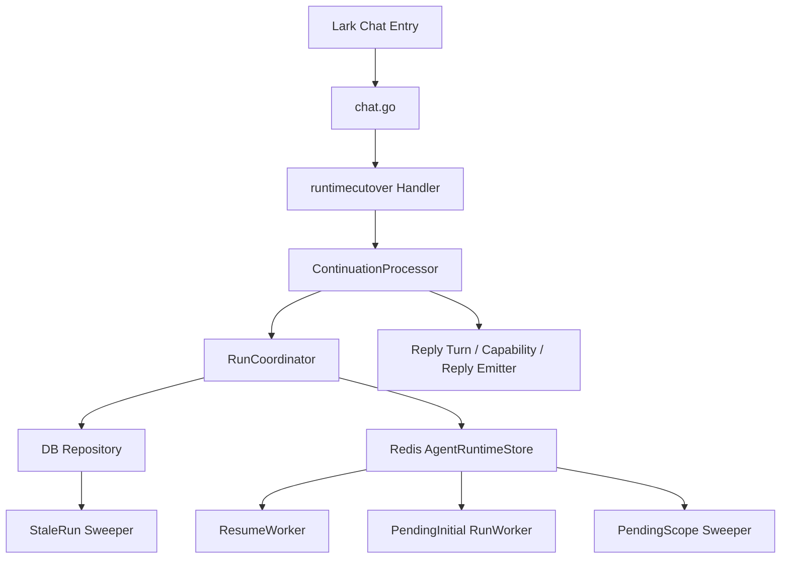

### 2.2 分层职责

| 层 | 主要实现 | 责任 |
| --- | --- | --- |
| Chat 入口层 | [`chat.go`](./chat.go)、[`chatflow/entry.go`](./chatflow/entry.go) | 把 Lark event 解析成 `ChatGenerationPlan` 和 `RuntimeAgenticCutoverRequest` |
| Cutover 层 | [`runtimecutover/runtime_chat.go`](./runtimecutover/runtime_chat.go)、[`runtimecutover/runtime_text.go`](./runtimecutover/runtime_text.go) | 决定直接走 runtime 还是降级；处理 outstanding 限流与 pending queue |
| Processor 层 | [`initial.go`](./initial.go)、[`continuation_processor.go`](./continuation_processor.go) | 解释“当前 run 处在什么状态，下一步该推进到哪里” |
| Coordinator 层 | [`coordinator.go`](./coordinator.go)、[`approval_runtime.go`](./approval_runtime.go)、[`reply_completion.go`](./reply_completion.go) | 对 DB / Redis 做 durable 状态写入，保证状态转换合法 |
| Step/Reply 支撑层 | [`reply_turn.go`](./reply_turn.go)、[`reply_emitter.go`](./reply_emitter.go)、[`continuation_processor_support.go`](./continuation_processor_support.go) | 做模型 turn loop、reply target 投影、回复落地 |
| 异步运行层 | [`resume.go`](./resume.go)、[`initial/pending_worker.go`](./initial/pending_worker.go)、[`initial/pending_scope_sweeper.go`](./initial/pending_scope_sweeper.go)、[`stale_run_sweeper.go`](./stale_run_sweeper.go) | 消费 resume queue / pending initial queue，并修复 stale queued/running run |
| 存储适配层 | [`../../../infrastructure/agentstore/repository.go`](../../../infrastructure/agentstore/repository.go)、[`../../../infrastructure/redis/agentruntime.go`](../../../infrastructure/redis/agentruntime.go) | DB 仓储 + Redis 协调原语 |

---

## 3. 核心数据模型与不变量

定义都在 [`types.go`](./types.go)。

### 3.1 `AgentSession`

`AgentSession` 是 chat 级会话容器，不是一次运行。

关键字段：

- `ChatID` / `ScopeType` / `ScopeID`
- `Status`
- `ActiveRunID`
- `LastMessageID`
- `LastActorOpenID`

关键不变量：

1. 一个 session 可以有多条历史 run，但只有一个 `ActiveRunID`。
2. `LastMessageID` / `LastActorOpenID` 不是业务结果，而是 follow-up attach 判定锚点。
3. session 的 `Status` 只是会话态，不承担 run 状态机语义。

### 3.2 `AgentRun`

`AgentRun` 是 durable 执行实例。

关键字段：

- `Status`
- `CurrentStepIndex`
- `WaitingReason`
- `WaitingToken`
- `Revision`
- `LastResponseID`
- `ResultSummary`

关键不变量：

1. `Status` 只描述 run 的大状态，不描述下一步具体动作。
2. `CurrentStepIndex` 指向当前活动 step 光标，不一定只是“最后一个 step”。
3. 真实 continuation 语义必须结合 `CurrentStepIndex + step 序列` 一起看。
4. `Revision` 是 run 级乐观并发版本，任何状态更新都通过 repo compare-and-swap 完成。

### 3.3 `AgentStep`

`AgentStep` 是 durable execution log。

关键字段：

- `Index`
- `Kind`
- `Status`
- `InputJSON`
- `OutputJSON`
- `ExternalRef`

关键不变量：

1. `Index` 在 run 内单调递增。
2. `Kind` 定义语义，`Status` 定义执行状态，两者缺一不可。
3. `ExternalRef` 承担很多锚点职责：
   - capability call id
   - approval token
   - 回复 message/card id
   - continuation observe 的外部引用
4. 很多 step 会“直接以 completed 形式创建”，因为它们本身就是持久化快照，而不是需再次执行的工作单元。

### 3.4 DB 是真相源，Redis 不是

`agentruntime` 的核心真相来源在 DB repository：

- run create/update：[`RunRepository.Create`](../../../infrastructure/agentstore/repository.go)、[`RunRepository.UpdateStatus`](../../../infrastructure/agentstore/repository.go)
- step append/update：[`StepRepository.Append`](../../../infrastructure/agentstore/repository.go)、[`StepRepository.UpdateStatus`](../../../infrastructure/agentstore/repository.go)

Redis 只承担：

- active run 指针
- execution lease
- resume queue
- pending initial queue
- approval reservation

也就是：

- DB 决定“现在是什么状态”
- Redis 决定“谁能推进、何时推进”

### 3.5 Repo 并发控制

repo 的关键语义：

- [`RunRepository.UpdateStatus`](../../../infrastructure/agentstore/repository.go) 用 `revision` 做 CAS，并调用 [`ValidateRunStatusTransition`](./types.go)
- [`StepRepository.UpdateStatus`](../../../infrastructure/agentstore/repository.go) 用 `fromStatus` 做 CAS，并调用 [`ValidateStepStatusTransition`](./types.go)

这意味着：

1. 任意状态推进都必须显式声明“我以为当前状态是什么”。
2. 非法跳转和并发竞争都会在 repo 层被挡住。

---

## 4. 总执行模型

### 4.1 四条入口

`agentruntime` 当前有四种真实入口：

| 入口 | 函数 | 输入 | 作用 |
| --- | --- | --- | --- |
| 初始聊天入口 | [`AgenticChatEntryHandler.Handle`](./chat.go) | Lark message | 从消息触发一个 initial run |
| 标准文本入口 | [`StandardHandler.Handle`](./runtimecutover/runtime_text.go) | 标准文本 cutover 请求 | 非 agentic 模式下也走 runtime 结构 |
| resume 异步入口 | [`ResumeWorker.run`](./resume.go) | `ResumeEvent` | approval/callback/schedule 恢复执行 |
| pending initial 异步入口 | [`initialcore.Worker.Run`](./initialcore/worker.go) | `PendingRun` | 当初始执行被 lease 挡住时补偿执行 |

### 4.2 两类 processor 输入

`ContinuationProcessor` 只有一个总入口：[`ContinuationProcessor.ProcessRun`](./initial.go)。

它只接受两类 mutually exclusive 输入：

- `InitialRunInput`
- `ResumeEvent`

分发逻辑：

- `InitialRunInput` -> [`processInitialRun`](./initial.go)
- `ResumeEvent` -> [`ProcessResume`](./continuation_processor.go)

### 4.3 两层状态机

`agentruntime` 的状态机不是单表，而是两层组合：

第一层：run 状态机

- `queued`
- `running`
- `waiting_approval`
- `waiting_schedule`
- `waiting_callback`
- `completed`
- `failed`
- `cancelled`

第二层：step 状态机

- `decide`
- `plan`
- `capability_call`
- `observe`
- `reply`
- `approval_request`
- `wait`
- `resume`

结论：

- `run.status` 决定“这个 run 现在大致在哪个阶段”
- `current_step_index + step.kind/status` 决定“processor 下一步具体执行什么”

---

## 5. Run 状态机

### 5.1 Run 节点总表

| 节点 | 语义 | 主要进入函数 | 主要离开函数 | 备注 |
| --- | --- | --- | --- | --- |
| `queued` | 待推进 | [`RunCoordinator.StartShadowRun`](./coordinator.go)、[`RunCoordinator.ResumeRun`](./coordinator.go)、[`RunCoordinator.ContinueRunWithReply`](./reply_completion.go)、[`ContinuationProcessor.continueQueuedCapabilityTail`](./continuation_processor_support.go) | [`ContinuationProcessor.moveRunToRunning`](./continuation_processor_support.go)、[`RunCoordinator.CancelRun`](./coordinator.go) | 最常见的可调度状态 |
| `running` | 当前执行中 | [`ContinuationProcessor.moveRunToRunning`](./continuation_processor_support.go)、[`RunCoordinator.moveRunToRunning`](./runtime_step_support.go) | waiting / completed / failed / cancelled | 会持有 execution lease |
| `waiting_approval` | 等审批 | [`RunCoordinator.RequestApproval`](./coordinator.go)、[`RunCoordinator.ActivateReservedApproval`](./approval_runtime.go) | [`RunCoordinator.ResumeRun`](./coordinator.go)、[`RunCoordinator.RejectApproval`](./coordinator.go) | `WaitingToken` 必填 |
| `waiting_schedule` | 等 schedule | 外部 wait/schedule 逻辑设置 | [`RunCoordinator.ResumeRun`](./coordinator.go) | 当前文件中只消费不生产 |
| `waiting_callback` | 等 callback | 外部 callback/wait 逻辑设置 | [`RunCoordinator.ResumeRun`](./coordinator.go) | 当前文件中只消费不生产 |
| `completed` | 已完成 | [`RunCoordinator.CompleteRunWithReply`](./reply_completion.go) | 终态 | 会清理 active slot |
| `failed` | 执行失败 | [`ContinuationProcessor.failCapabilityRun`](./continuation_processor.go)、[`ContinuationProcessor.failRunIfStillRunning`](./continuation_processor.go) | 终态 | 会清理 active slot |
| `cancelled` | 被取消 | [`RunCoordinator.CancelRun`](./coordinator.go)、[`RunCoordinator.RejectApproval`](./coordinator.go) | 终态 | 也会唤醒 pending scope |

### 5.2 合法转移

实际合法转移定义在 [`ValidateRunStatusTransition`](./types.go)：

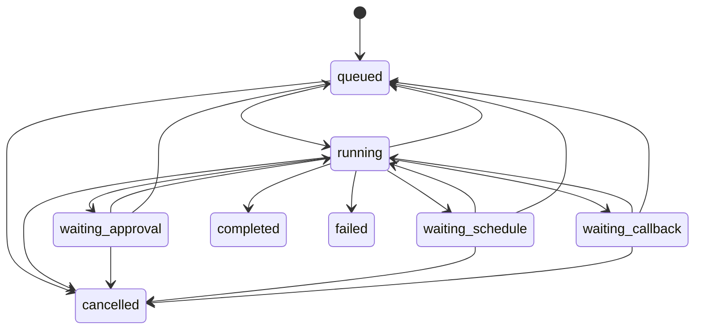

### 5.3 关键转移函数矩阵

| 转移 | 函数 | 持久化写入 |
| --- | --- | --- |
| `nil -> queued` | [`RunCoordinator.StartShadowRun`](./coordinator.go) | create run + append `decide(queued)` + session active run |
| `running -> waiting_approval` | [`moveRunToWaitingApproval`](./approval_runtime.go) | run status / waiting fields / current step index |
| `waiting_* -> queued` | [`RunCoordinator.ResumeRun`](./coordinator.go) | run queued + clear waiting + append `resume(queued)` |
| `running -> completed` | [`RunCoordinator.CompleteRunWithReply`](./reply_completion.go) | complete current step + append capability history + append `reply(completed)` + clear active state |
| `running -> queued` | [`RunCoordinator.ContinueRunWithReply`](./reply_completion.go) | append reply + append queued `capability_call` |
| `running -> failed` | [`ContinuationProcessor.failCapabilityRun`](./continuation_processor.go) | step failed + run failed + clear active slot |
| `* -> cancelled` | [`RunCoordinator.CancelRun`](./coordinator.go)、[`RunCoordinator.RejectApproval`](./coordinator.go) | run cancelled + clear active slot + bump cancel generation |

### 5.4 waiting 状态的真实含义

`WaitingReason` 不是冗余字段，它是 `ResumeEvent` 校验的一部分。

resume 时：

- [`waitingRunStatusForResumeSource`](./coordinator.go) 决定 source 期待的 run status
- [`ResumeEvent.WaitingReason`](./resume.go) 决定 source 期待的 waiting reason
- [`RunCoordinator.ResumeRun`](./coordinator.go) 同时校验 status、waiting reason、token

也就是：

- source 对错了，但 token 对了，不行
- status 对了，但 waiting reason 错了，也不行

---

## 6. Step 状态机

### 6.1 Step Status

定义见 [`types.go`](./types.go)。

| Step Status | 语义 | 典型入口 |
| --- | --- | --- |
| `queued` | 该 step 是下一步待执行工作 | `decide/plan/capability_call/resume` 常见 |
| `running` | step 正在执行 | capability step、resume step |
| `completed` | step 已持久化完成 | observe/reply/approval_request 常见 |
| `failed` | step 执行失败 | capability 执行异常 |
| `skipped` | step 被逻辑跳过 | reply 覆盖/兼容路径保留 |

合法转移：

- `queued -> running`
- `queued -> skipped`
- `running -> completed`
- `running -> failed`
- `running -> skipped`

### 6.2 Step Kind 节点表

| Step Kind | 创建函数 | `InputJSON` | `OutputJSON` | `ExternalRef` | 下一步如何解释 |
| --- | --- | --- | --- | --- | --- |
| `decide` | [`RunCoordinator.StartShadowRun`](./coordinator.go)、[`RunCoordinator.attachShadowRun`](./coordinator.go) | attach 时写入 trigger/input | 无 | 空 | 初始决策入口，随后通常进入 `plan` |
| `plan` | [`RunCoordinator.QueuePlanStep`](./reply_completion.go)、[`runInitialCapabilityTraceRecorder.RecordReplyTurnPlan`](./initial_trace.go) | thought/reply/pending capability | 通常无 | 空 | 表示“模型已经形成下一步计划” |
| `capability_call` | [`newQueuedCapabilityStep`](./reply_completion.go)、[`newCompletedCapabilityStep`](./reply_completion.go) | `CapabilityCallInput` | `CapabilityResult` 编码 | call id | 当前 queued capability 的真正执行入口 |
| `observe` | [`newCapabilityObserveStep`](./continuation_step_support.go)、[`newCompletedCapabilityObserveStep`](./reply_completion.go)、[`buildContinuationPlan`](./continuation_processor.go) | continuation observe 通常无 | capability output 或 resume observation | 外部引用 | 给后续 continuation / projection 提供上下文 |
| `reply` | [`newReplyCompletionStep`](./runtime_step_support.go)、[`newCapabilityReplyStep`](./continuation_step_support.go)、[`newContinuationReplyStep`](./continuation_step_support.go) | 无 | reply text、targets、lifecycle | message/card id | reply target 投影的关键来源 |
| `approval_request` | [`newCompletedApprovalStep`](./approval_runtime.go) | `approvalStepState` | 无 | approval token | 当前 run 已进入 waiting_approval |
| `wait` | 当前子树未看到 durable creator | 预留 | 预留 | 预留 | continuation 文案已支持，但创建逻辑在其他子系统 |
| `resume` | [`RunCoordinator.ResumeRun`](./coordinator.go) | 无 | completion 时写入 `continuationObservation` | step id 或 source | continuation lane 的 durable 入口 |

### 6.3 `CurrentStepIndex` 的含义

`CurrentStepIndex` 不是“最后一个 step”的简单别名。

它的作用是：

1. 给 `RunProjection.CurrentStep` 提供活跃节点。
2. 让 `ProcessResume` 能知道现在要不要 replay capability。
3. 在 initial trace recorder 期间允许 run 光标提前前移，以便发生中途失败时仍能恢复到已记录的 step。

关键写入点：

- [`RunCoordinator.StartShadowRun`](./coordinator.go)
- [`RunCoordinator.attachShadowRun`](./coordinator.go)
- [`RunCoordinator.QueuePlanStep`](./reply_completion.go)
- [`RunCoordinator.ContinueRunWithReply`](./reply_completion.go)
- [`RunCoordinator.ResumeRun`](./coordinator.go)
- [`runInitialCapabilityTraceRecorder.advanceRunCursor`](./initial_trace.go)

---

## 7. 持久化写入矩阵

这一节只看“哪些函数会改 durable 状态”。

### 7.1 RunCoordinator 级写入

| 函数 | run 写入 | step 写入 | session 写入 | Redis 写入 |
| --- | --- | --- | --- | --- |
| [`StartShadowRun`](./coordinator.go) | create `queued` run | append `decide(queued)` | `SetActiveRun` | 无 |
| [`attachShadowRun`](./coordinator.go) | run -> `queued`、`CurrentStepIndex=next` | append `decide(queued)` | `SetActiveRun` | 无 |
| [`CancelRun`](./coordinator.go) | run -> `cancelled` | 无 | clear session active | cancel generation、clear active actor slot、notify pending |
| [`RequestApproval`](./coordinator.go) | run -> `waiting_approval` | append `approval_request(completed)` | 无 | 无 |
| [`RejectApproval`](./coordinator.go) | run -> `cancelled` | 无 | clear session active | clear active actor slot、notify pending |
| [`ResumeRun`](./coordinator.go) | run `waiting_* -> queued` | append `resume(queued)` | 无 | 无 |
| [`QueuePlanStep`](./reply_completion.go) | run -> `running`，光标前移 | complete source step + append `plan(queued)` | 无 | 无 |
| [`CompleteRunWithReply`](./reply_completion.go) | run -> `completed` | complete current + append capability history + append `reply(completed)` | clear session active | clear active actor slot、notify pending |
| [`ContinueRunWithReply`](./reply_completion.go) | run -> `queued` | complete current + append capability history + append `reply(completed)` + append `capability_call(queued)` | 无 | 无 |
| [`ReserveApproval`](./approval_runtime.go) | 无 | 无 | 无 | save approval reservation |
| [`ActivateReservedApproval`](./approval_runtime.go) | run 可能 `running -> waiting_approval` | append missing `approval_request(completed)` | 无 | consume reservation |

### 7.2 Processor 级写入

| 函数 | durable 副作用 |
| --- | --- |
| [`processInitialRunWithLease`](./initial.go) | `StartShadowRun`、`QueuePlanStep`、`CompleteRunWithReply` 或 `ContinueRunWithReply` |
| [`processCapabilityCall`](./continuation_processor.go) | `moveRunToRunning`、step `queued->running->completed/failed`、append `observe`、可能进入 approval |
| [`completeCapabilityReplyTurn`](./continuation_processor.go) | append completed capability history、append `plan`、append `reply`、可继续排下一个 capability |
| [`completeContinuationReplyTurn`](./continuation_processor.go) | append completed capability history、append `plan`、append `reply` |
| [`executeContinuationPlan`](./continuation_processor.go) | complete `resume` step、append continuation `observe`、再走 reply 收尾 |
| [`failCapabilityRun`](./continuation_processor.go) | capability step -> failed、run -> failed、clear active slot |

### 7.3 Worker/Queue 级写入

| 函数 | durable / queue 副作用 |
| --- | --- |
| [`ResumeDispatcher.Dispatch`](./resume.go) | 先同步 `ResumeRun`，再 `EnqueueResumeEvent` |
| [`ResumeWorker.run`](./resume.go) | 消费 Redis resume queue，不直接改 DB，改 DB 的是 processor |
| [`runtimecutover.Handler.enqueuePendingInitialRun`](./runtimecutover/runtime_chat.go) | 发“排队中”初始回复，再 `EnqueuePendingInitialRun` |
| [`initialcore.Worker.handleScope`](./initialcore/worker.go) | 消费队列、失败时回队头、成功时清 scope |
| [`Sweeper.handleScope`](./initial/pending_scope_sweeper.go) | 根据 backlog 与 active execution lease 决定 reschedule/clear/skip |

---

## 8. 场景时序 1：初始消息直接完成

这是最短链路，没有 queued capability，没有审批。

### 8.1 序列图

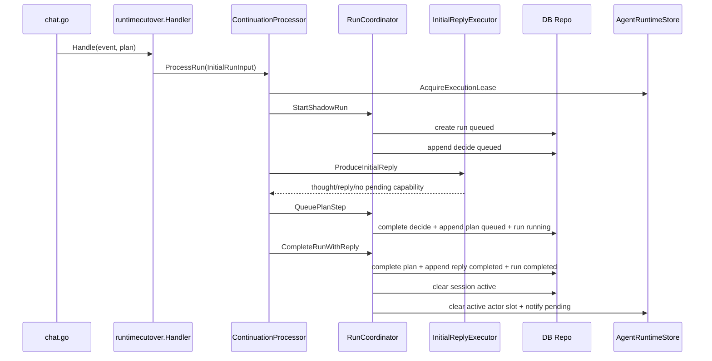

### 8.2 逐步展开

#### A. 入口组装 request

1. [`AgenticChatEntryHandler.Handle`](./chat.go) 调 [`chatflow.AgenticEntryHandler.BuildRequest`](./chatflow/entry.go)。
2. 该阶段完成：
   - 模型 ID 选择
   - reasoning effort
   - files 收集
   - mention / mute 判断
3. 产物是 `RuntimeAgenticCutoverRequest`。

#### B. cutover 边界

[`runtimecutover.Handler.Handle`](./runtimecutover/runtime_chat.go)：

1. 把 Lark event 组装成 `InitialRunInput`
2. 构造 `StartShadowRunRequest`
3. 在 runtime 可用时走 `processor.ProcessRun`
4. execution lease 抢不到时才转 pending queue

#### C. 获取 execution lease

[`ContinuationProcessor.processInitialRun`](./initial.go) 包在 [`withExecutionLease`](./continuation_processor.go) 内。

Redis 调用是：

- [`AgentRuntimeStore.AcquireExecutionLease`](../../../infrastructure/redis/agentruntime.go)
- key: `agent_runtime/execution_lease/<chat>/<actor>`

它不是 durable 状态，而是“当前谁能推进”的短 TTL 临界区。

#### D. 创建 run 和首个 decide step

[`RunCoordinator.StartShadowRun`](./coordinator.go)：

1. `FindOrCreateChatSession`
2. `FindByTriggerMessage` 做幂等去重
3. `ensureActiveRunCapacity`
4. create run:
   - `status=queued`
   - `current_step_index=0`
5. append `step[0]=decide(queued)`
6. `SetActiveRun`

#### E. 初始模型回复执行

[`InitialRunInput.BuildExecutor`](./initial.go) 默认构造 [`defaultInitialReplyExecutor`](./initial.go)。

它内部：

1. `generateStream`
2. 对 stream 套两层 wrapper：
   - [`wrapInitialPendingApprovalDispatcher`](./initial_trace.go)
   - [`wrapInitialReplyStreamRecorder`](./initial_trace.go)
3. 交给 `InitialReplyEmitter.EmitInitialReply`

#### F. 初始 reply loop 细节

agentic 模式下，stream 来自 [`BuildRuntimeInitialChatLoop`](./reply_turn.go)。

该 loop 实际行为是：

1. build `InitialChatExecutionPlan`
2. 调 [`StreamInitialChatLoop`](./reply_turn.go)
3. 每一轮：
   - 先执行一个模型 turn：[`chatflow.ExecuteInitialChatTurn`](./chatflow/turn.go)
   - 得到 stream + snapshot
   - 如果 snapshot 里没有 tool call，就结束
   - 如果有 tool call，就本地执行 capability
   - 产出 synthetic `CapabilityCallTrace`
   - 把 tool output 和 `previous_response_id` 喂给下一轮

也就是说：

- 初始模型 loop 本身就是一个“模型 turn -> 本地 capability -> 再次模型 turn”的内循环
- 但 durable run/step 并不在这个 loop 内直接创建，真正 durable 化发生在 loop 输出被 processor 接住之后

#### G. durable 化为 plan + reply

当 initial reply 完成且没有 pending capability：

1. [`RunCoordinator.QueuePlanStep`](./reply_completion.go)
   - 完成 `decide`
   - 追加 `plan(queued)`
   - run -> `running`
2. [`RunCoordinator.CompleteRunWithReply`](./reply_completion.go)
   - 完成 `plan`
   - 补写已完成 capability trace
   - append `reply(completed)`
   - run -> `completed`
   - 清 session active
   - 清 Redis active actor slot
   - 唤醒 pending initial queue

---

## 9. 场景时序 2：初始消息生成 queued capability

这是 “初始回复先给用户，后面还有一个 capability 要继续跑” 的链路。

### 序列图

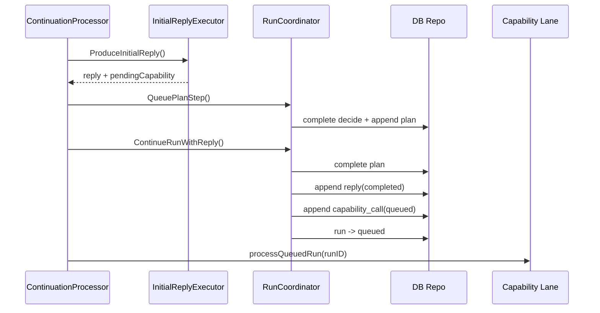

### 9.1 分叉点

分叉发生在 [`ContinuationProcessor.processInitialRunWithLease`](./initial.go)：

- `reply.PendingCapability == nil` -> 直接完成
- `reply.PendingCapability != nil` -> `ContinueRunWithReply`

### 9.2 `ContinueRunWithReply` 写了什么

[`RunCoordinator.ContinueRunWithReply`](./reply_completion.go) 的 durable 写入顺序：

1. 保证 run 是 `running`
2. 完成当前 step
3. 补写前面已经完成的 capability trace
4. append `reply(completed)`
5. append `capability_call(queued)`
6. run -> `queued`
7. `CurrentStepIndex = queued capability step`

所以它的语义不是“继续执行”，而是：

把“回复已发出、接下来还有 capability 待执行” durable 化。

### 9.3 为什么 `reply` 先于 `capability_call`

因为这条 runtime 的语义是：

1. 用户先看到模型答复或进度答复
2. run 再转入下一段 capability lane

这样做有两个直接后果：

1. reply target 可以立刻作为后续 patch/reply 的锚点
2. 即使 capability lane 后续失败，用户侧也已经有一个 durable reply anchor

---

## 10. 场景时序 3：初始 stream 中发现待审批 capability

这是当前 runtime 最容易漏看的链路。

### 序列图

```mermaid
sequenceDiagram
    participant Loop as Initial Chat Loop
    participant Wrap as PendingApproval Dispatcher
    participant Coord as RunCoordinator
    participant Redis as Approval Reservation
    participant Sender as ApprovalSender
    participant Stream as Capability Trace

    Loop-->>Wrap: pending CapabilityCallTrace
    Wrap->>Wrap: build QueuedCapabilityCall
    Wrap->>Coord: ReserveApproval()
    Coord->>Redis: SaveApprovalReservation(stepID, token)
    Coord-->>Wrap: ApprovalRequest
    Wrap->>Sender: SendApprovalCard()
    Sender-->>Wrap: card sent
    Wrap-->>Stream: trace.ApprovalStepID/token 回填
```

### 10.1 关键点

审批不一定在 capability lane 才首次出现。

在 initial stream 里，模型就可能先规划出一个“待审批 capability”。这时 runtime 不直接推进 capability，而是先做 approval reservation。

### 10.2 reservation 是怎么产生的

链路在 [`initial_trace.go`](./initial_trace.go)：

1. [`wrapInitialPendingApprovalDispatcher`](./initial_trace.go) 拦截 stream 中的 `CapabilityCallTrace`
2. 若 `trace.Pending == true`
3. 且当前 trace 还没有 `ApprovalStepID/ApprovalToken`
4. 则把 trace 还原成 `QueuedCapabilityCall`
5. 再调 [`immediateInitialPendingApprovalDispatcher.DispatchInitialPendingApproval`](./initial_trace.go)

### 10.3 reservation 的 durable 行为

`DispatchInitialPendingApproval` 内部：

1. 通过 [`RunCoordinator.ReserveApproval`](./approval_runtime.go) 在 Redis 保存 reservation
2. 通过 [`ApprovalSender.SendApprovalCard`](./approval/sender.go) 立刻发审批卡
3. 把生成的 `step_id` / `token` 回填到 trace

这意味着：

- initial stream 阶段就可以把审批卡发出去
- 但 run 还没有立即切到 `waiting_approval`
- 真正切换发生在之后 capability lane 里调用 `ActivateReservedApproval`

### 10.4 为什么要先 reservation 再 activate

因为 initial stream 阶段仍处在“生成答复”的内循环里。

如果当场把 run 改成 `waiting_approval`，会导致：

1. 当前 initial lane 和后续 async resume lane 相互竞态
2. reply 还没 durable 化，reply target 可能丢
3. 同一条审批可能被重复创建

所以 reservation 的职责是：

- 先把审批身份和 token 稳定下来
- 等 capability lane 真正到达该点时再激活

---

## 11. 场景时序 4：capability lane 正常执行

### 序列图

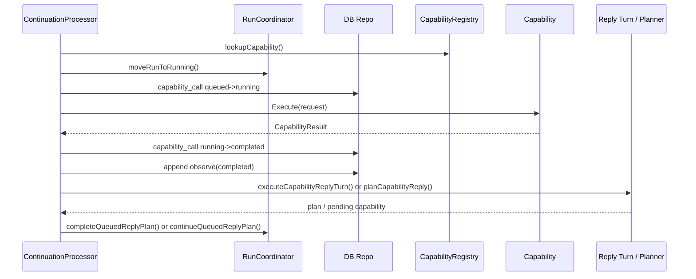

### 11.1 capability 入口

当 `CurrentStepIndex` 指向 `capability_call` 时，processor 走 [`processCapabilityCall`](./continuation_processor.go)。

该函数顺序：

1. decode `CapabilityCallInput`
2. `hydrateCapabilityRequest`
3. `lookupCapability`
4. run -> `running`
5. 如果需要审批，走 approval 分支
6. 否则执行 capability

### 11.2 capability 执行成功

[`executeCapabilityCall`](./continuation_processor.go) 顺序如下：

1. [`startCapabilityStep`](./continuation_processor.go)
   - step `queued -> running`
2. `invokeCapability`
3. step `running -> completed`
   - `OutputJSON = CapabilityResult`
   - `ExternalRef = result.ExternalRef`
4. append `observe(completed)`
5. 如果有 queue tail，走 [`continueQueuedCapabilityTail`](./continuation_processor_support.go)
6. 否则尝试 reply turn executor
7. 再根据结果走 `completeCapabilityReplyTurn` 或 `planCapabilityReply`

### 11.3 capability 执行失败

[`failCapabilityRun`](./continuation_processor.go)：

1. 若 capability step 还在 `running`，先改成 `failed`
2. run -> `failed`
3. 清 active slot

这个函数是 capability lane 的错误收口点。

---

## 12. 场景时序 5：capability 后的 reply turn loop

这是第二个容易被忽略的深层结构。

### 序列图

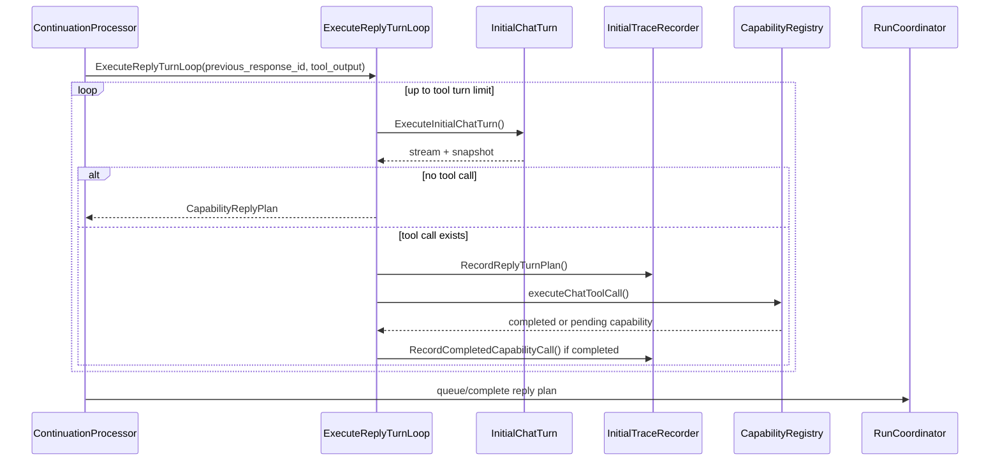

### 12.1 它不是普通 reply planner

capability 执行完后，runtime 不一定直接调用一个“静态文案模板”。

优先路径是：

- [`executeCapabilityReplyTurn`](./continuation_processor.go)
- 默认实现是 [`defaultCapabilityReplyTurnExecutor.ExecuteCapabilityReplyTurn`](./reply_turn.go)
- 内部又跑了一次 [`ExecuteReplyTurnLoop`](./reply_turn.go)

### 12.2 这个 loop 做了什么

`ExecuteReplyTurnLoop` 的行为：

1. 用 `previous_response_id + tool_output` 开一轮模型 turn
2. 从 stream 收集 `CapabilityReplyPlan`
3. 如果模型没有再发 tool call：
   - 结束
   - 输出最终 `thought/reply`
4. 如果模型又发了 tool call：
   - 先把这轮 plan durable 化：`Recorder.RecordReplyTurnPlan`
   - 本地执行 tool
   - 完成的 tool trace 记入 completed capability history
   - pending tool trace 记入 `PendingCapability`
   - 再把新 `previous_response_id` 和 tool output 带进下一轮

也就是：

- capability 之后还有一个“小型 continuation loop”
- 它也允许继续串行规划更多 capability
- 但 runtime 强约束为一次只推进一个需要再喂回模型的 pending capability

### 12.3 durable 化结果

`ExecuteReplyTurnLoop` 的结果不会直接自己写 DB。

真正 durable 化发生在：

- [`completeCapabilityReplyTurn`](./continuation_processor.go)

它会：

1. 追加 reply turn 中完成的 capability history
2. 追加 `plan`
3. 发 reply
4. 若还有 pending capability：
   - `continueQueuedReplyPlan`
   - 再生成 queued `capability_call`
5. 否则：
   - `completeQueuedReplyPlan`
   - run -> `completed`

---

## 13. 场景时序 6：live approval 请求

这是 capability lane 里真的进入 `waiting_approval` 的地方。

### 序列图

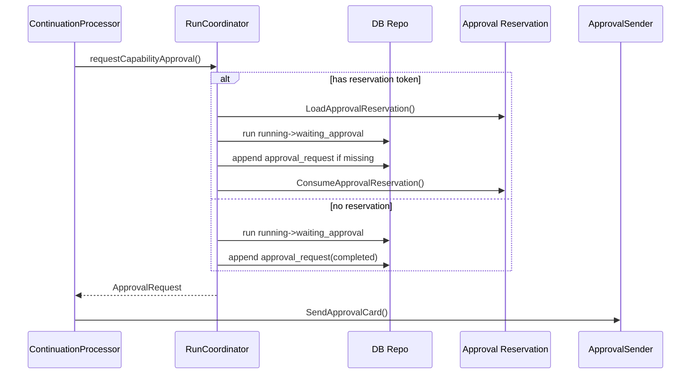

### 13.1 入口

[`requestCapabilityApproval`](./continuation_processor.go)

先看输入里的 approval spec：

- 如果带有 `ReservationStepID/ReservationToken`
  - 优先走 [`RunCoordinator.ActivateReservedApproval`](./approval_runtime.go)
- 否则
  - 直接走 [`RunCoordinator.RequestApproval`](./coordinator.go)

### 13.2 激活 reservation 的行为

[`RunCoordinator.ActivateReservedApproval`](./approval_runtime.go)：

1. 从 Redis 读取 reservation
2. 校验 reservation 还没过期
3. 读取 run
4. 如果 run 当前是 `running`
   - 调 `moveRunToWaitingApproval`
5. 如果 run 已经是同 token 的 `waiting_approval`
   - 直接接受
6. 若缺 `approval_request` step，则补写一个 completed step
7. 消费 reservation
8. 若 reservation 里已经有 decision：
   - 返回 decision，让调用方直接走批准/拒绝后续逻辑

### 13.3 即时 approval 的行为

[`RunCoordinator.RequestApproval`](./coordinator.go)：

1. 生成 `token` 和 `stepID`
2. run `running -> waiting_approval`
3. `CurrentStepIndex++`
4. append `approval_request(completed)`
5. 返回 `ApprovalRequest`

### 13.4 approval_request step 的数据

`approval_request` step 的结构：

- `InputJSON`: [`approvalStepState`](./approval/types.go)
- `ExternalRef`: approval token

这点很重要，因为后续 `validateApprovalResume` 是通过当前 step 去 decode request 的。

---

## 14. 场景时序 7：审批通过后的 resume replay

### 序列图

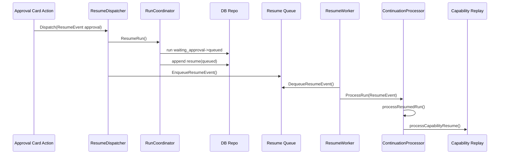

### 14.1 点击到 async resume

审批卡点击后，外部 card action 层会构造 `ResumeEvent`。

runtime 内的处理入口是：

- [`ResumeDispatcher.Dispatch`](./resume.go)

它不是纯异步，它做两件事：

1. 先同步调用 [`RunCoordinator.ResumeRun`](./coordinator.go)
2. 再把 event 入 Redis：[`EnqueueResumeEvent`](../../../infrastructure/redis/agentruntime.go)

也就是说：

- durable 状态迁移是同步完成的
- 真正的 continuation 执行是异步的

### 14.2 `ResumeRun` 的同步写入

`ResumeRun` 做的事：

1. 校验 `ResumeEvent`
2. approval 场景先 [`validateApprovalResume`](./coordinator.go)
3. run:
   - `waiting_approval -> queued`
   - 清空 `WaitingReason/WaitingToken`
   - `CurrentStepIndex++`
4. append `resume(queued)`

### 14.3 resume worker 执行

[`ResumeWorker.run`](./resume.go)：

1. `DequeueResumeEvent`
2. `AcquireRunLock`
3. `processor.ProcessRun(ResumeEvent)`
4. `ReleaseRunLock`

这里的 `run lock` 是 resume queue 级互斥，和 execution lease 不是同一个概念。

### 14.4 replay 判定

[`processResumedRun`](./continuation_processor.go) 的第一层决策：

1. 如果当前 step 是 `resume`
2. 并且 [`RunProjection.ReplayableCapabilityStepBefore`](./continuation_processor_support.go) 能在前面找到一个 queued/running 的 `capability_call`
3. 且 source 是 approval
4. 则走 [`processCapabilityResume`](./continuation_processor.go)

### 14.5 replay capability 的真正行为

`processCapabilityResume`：

1. 先把 run 拉回 `running`
2. 基于 `resume step + capability step` 生成 continuation plan
3. 先把 `resume` step durable 完成
4. 再 decode 原 capability input
5. 再 lookup capability
6. 重新执行 capability call

所以 approval resume 不是“从审批卡往下直接接着跑”，而是：

重新回到审批前那个 capability 节点，基于 durable input 再执行一次。

---

## 15. 场景时序 8：审批拒绝

### 序列图

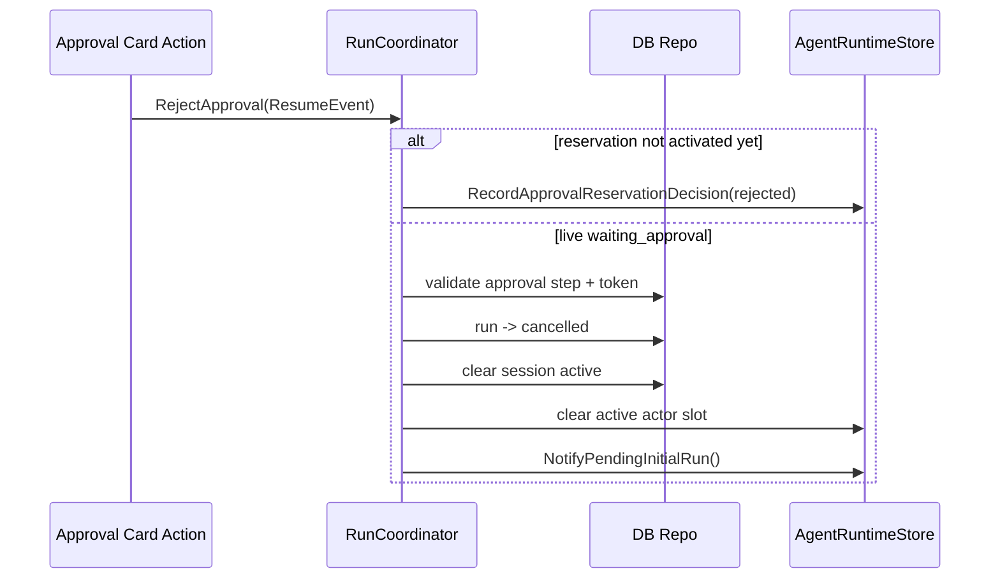

拒绝链路是 [`RunCoordinator.RejectApproval`](./coordinator.go)。

行为：

1. 先校验 event
2. 若当前 run 还没真正进入 `waiting_approval`，尝试把 reject 记到 reservation decision
3. 否则校验当前 `approval_request` step 和 token
4. run -> `cancelled`
5. `ErrorText = approval_rejected`
6. 清 session active
7. 清 Redis active actor slot
8. 唤醒 pending initial queue

也就是说：

- reject 既支持 live approval，也支持 reservation 还没 activate 时的先行点击

---

## 16. 场景时序 9：callback / schedule resume

这条链路跟 approval 相似，但没有 capability replay 特判。

### 序列图

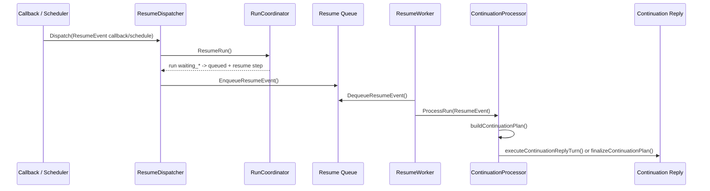

### 16.1 durable 预期

`ResumeEvent.Source`：

- `callback` -> 期待 run 状态 `waiting_callback`
- `schedule` -> 期待 run 状态 `waiting_schedule`

映射函数是 [`waitingRunStatusForResumeSource`](./coordinator.go)。

### 16.2 continuation 行为

对于 callback/schedule：

1. `ResumeRun` 先把 run 切回 `queued`
2. worker 再触发 `ProcessResume`
3. `processResumedRun` 通常不会走 capability replay
4. 而是走 [`buildContinuationPlan`](./continuation_processor.go)
5. append continuation `observe`
6. 再走 `executeContinuationReplyTurn` 或 fallback reply

### 16.3 continuation plan 的真正内容

`buildContinuationPlan` 生成的是一个 durable `observe` step，里面记录：

- `Source`
- `WaitingReason`
- `TriggerType`
- `ResumeStepID`
- `PreviousStepKind`
- `PreviousStepTitle`
- `Summary`
- `PayloadJSON`

也就是说，resume 之后并不是只吐一句话，而是先把“恢复事实”写成 durable observation。

---

## 17. 场景时序 10：lease 冲突与 pending initial queue

### 序列图

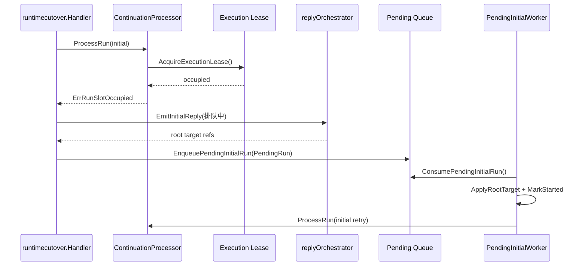

### 17.1 触发条件

当 [`withExecutionLease`](./continuation_processor.go) 抢不到 execution lease 时，返回 `ErrRunSlotOccupied`。

此时 [`runtimecutover.Handler.Handle`](./runtimecutover/runtime_chat.go) 走 [`enqueuePendingInitialRun`](./runtimecutover/runtime_chat.go)。

### 17.2 入队行为

入队不是静默的，顺序如下：

1. 先用 [`replyOrchestrator.EmitInitialReply`](./runtimecutover/runtime_output.go) 发一张“排队中”回复
2. 构造 [`PendingRun`](./initial/pending_run.go)
3. 把：
   - `StartShadowRunRequest`
   - `ChatGenerationPlan`
   - `OutputMode`
   - `Event Envelope`
   - `RootTarget`
   持久化进 Redis list
4. 如果队列位置大于 1，再 patch 卡片展示当前排队序号

### 17.3 `PendingRun` 的关键点

[`PendingRun`](./initial/pending_run.go) 除了保存请求，还保存 `RootTarget`。

它的作用是：

- 当这条任务未来真正被 worker 执行时，回复可以 patch/reply 到当初那张“排队中”卡片或其消息锚点

### 17.4 worker 执行模型

真正的 worker 框架在 [`initialcore/worker.go`](./initialcore/worker.go)。

每个 scope 是 `(chatID, actorOpenID)`。

worker 行为：

1. `DequeuePendingInitialScope`
2. `AcquirePendingInitialScopeLock`
3. `ConsumePendingInitialRun`
4. decode item
5. `ApplyContext`
6. `MarkStarted`
7. `Process`
8. 失败则 `PrependPendingInitialRun`
9. 可重试错误时发 wakeup 重试
10. scope 空了则 `ClearPendingInitialScopeIfEmpty`

### 17.5 started patch

在 pending initial worker 中，`MarkStarted` 默认是 [`LarkRunStatusUpdater.MarkStarted`](./initial/pending_worker.go)。

它会：

- 如果 `RootTarget.CardID` 存在
- 直接 patch 原排队卡片为“开始执行”

stream 内容来自 [`initialcore.StartedSeq`](./initialcore/delivery.go)。

---

## 18. 场景时序 11：pending scope sweeper

这是 pending queue 的补偿唤醒器。

### 序列图

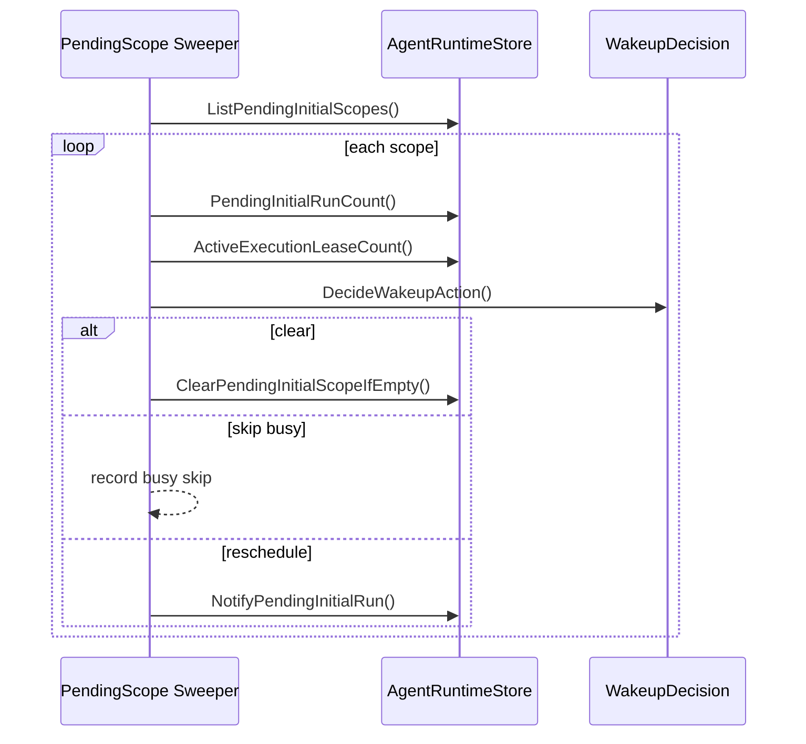

### 18.1 为什么需要 sweeper

`NotifyPendingInitialRun` 主要在 active slot 释放时触发。

但现实中可能出现：

- worker 中途退出
- wakeup 丢失
- scope list 残留
- 执行 lease 计数变化后无人重新唤醒

所以需要 [`Sweeper`](./initial/pending_scope_sweeper.go) 定期扫描。

### 18.2 行为逻辑

每个 scope 会算三个量：

- `PendingInitialRunCount`
- `ActiveExecutionLeaseCount`
- `MaxExecutionPerScope`

决策函数是 [`initialcore.DecideWakeupAction`](./initialcore/pending.go)：

- `PendingCount <= 0` -> clear
- `ActiveExecutionCount >= MaxExecutionPerScope` -> skip busy
- 否则 -> reschedule

### 18.3 意义

这保证了 pending queue 不是“只靠一次 wakeup 运气消费”，而是有周期性补偿机制。

---

## 19. 场景时序 12：attach 与 supersede

这是聊天态最容易影响用户体验的两条规则。

### 序列图

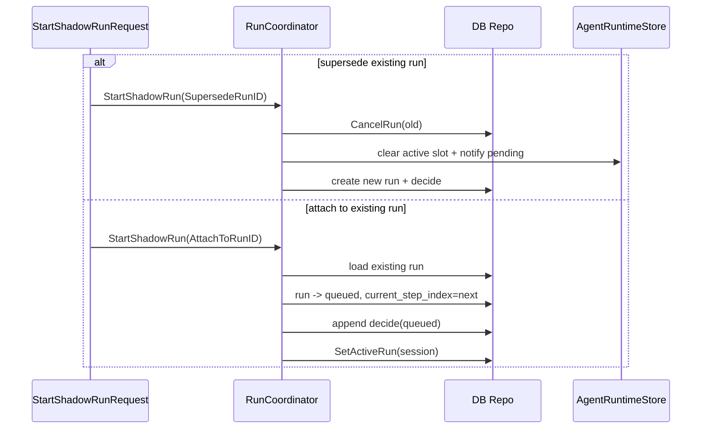

### 19.1 supersede

在 `StartShadowRunRequest` 中带 `SupersedeRunID` 时：

- [`RunCoordinator.StartShadowRun`](./coordinator.go) 会先调用 [`CancelRun`](./coordinator.go)
- 旧 run 被置为 `cancelled`
- active actor slot 释放
- pending queue 被唤醒
- 新 run 再按正常流程创建

### 19.2 attach

在 `StartShadowRunRequest` 中带 `AttachToRunID` 时：

- 不会创建新 run
- 而是走 [`RunCoordinator.attachShadowRun`](./coordinator.go)

它的行为是：

1. 读取旧 run
2. 若 run 已终态，直接返回
3. 生成新的 `decide(queued)` step
4. run -> `queued`
5. `CurrentStepIndex = next decide step`
6. 清 waiting 字段
7. 可更新 `InputText` / `ActorOpenID`

所以 attach 的本质是：

把 follow-up 触发变成“向现有 run 再插入一个 durable 决策点”。

---

## 20. reply target 投影与 lifecycle

### 20.1 为什么要投影

后续 patch / follow-up 回复不能依赖内存中的 message id。

所以 runtime 通过 [`RunProjection`](./continuation_processor_support.go) 从 step 序列反推 reply target。

### 20.2 四个关键投影

| 投影 | 函数 | 作用 |
| --- | --- | --- |
| root reply target | [`RunProjection.RootReplyTarget`](./continuation_processor_support.go) | 找最早有效 reply 锚点 |
| latest reply target | [`RunProjection.LatestReplyTarget`](./continuation_processor_support.go) | 找最近回复锚点 |
| latest reply target before index | [`RunProjection.LatestReplyTargetBefore`](./continuation_processor_support.go) | continuation 生成时取当前 step 之前的目标 |
| latest model reply target | [`RunProjection.LatestModelReplyTarget`](./continuation_processor_support.go) | 优先找模型 reply，而不是 capability compatible reply |

### 20.3 reply step 的数据结构

reply 输出 JSON 通常包含：

- `ThoughtText`
- `ReplyText`
- `ResponseMessageID`
- `ResponseCardID`
- `DeliveryMode`
- `LifecycleState`
- `TargetMessageID`
- `TargetCardID`
- `TargetStepID`

这类结构由：

- [`newReplyCompletionStep`](./runtime_step_support.go)
- [`newCapabilityReplyStep`](./continuation_step_support.go)
- [`newContinuationReplyStep`](./continuation_step_support.go)

生成。

### 20.4 superseded reply

投影函数会优先过滤 `LifecycleState = superseded` 的 reply。

如果找不到活跃 reply，再退化到历史 reply。

这就是 reply 生命周期和投影系统的耦合点。

---

## 21. Redis 协调原语

全部定义在 [`../../../infrastructure/redis/agentruntime.go`](../../../infrastructure/redis/agentruntime.go)。

### 21.1 active run 指针

| 原语 | 作用 |
| --- | --- |
| `ActiveChatRun` / `SwapActiveChatRun` | chat 级 active run |
| `ActiveActorChatRun` / `SwapActiveActorChatRun` | actor+chat 级 active run |

### 21.2 执行互斥

| 原语 | 作用 |
| --- | --- |
| `AcquireExecutionLease` / `RenewExecutionLease` / `ReleaseExecutionLease` | 控制同一 actor/chat 可并发推进的 execution 数 |
| `AcquireRunLock` / `ReleaseRunLock` | resume worker 对同一 run 的互斥 |
| `AcquirePendingInitialScopeLock` / `ReleasePendingInitialScopeLock` | pending initial worker 对同一 scope 的互斥 |

### 21.3 异步队列

| 原语 | 作用 |
| --- | --- |
| `EnqueueResumeEvent` / `DequeueResumeEvent` | resume 事件队列 |
| `EnqueuePendingInitialRun` / `ConsumePendingInitialRun` | pending initial run list |
| `NotifyPendingInitialRun` / `DequeuePendingInitialScope` | scope 唤醒队列 |

### 21.4 approval reservation

| 原语 | 作用 |
| --- | --- |
| `SaveApprovalReservation` | 保存 reservation |
| `LoadApprovalReservation` | 读取 reservation |
| `RecordApprovalReservationDecision` | 把 approve/reject 记到 reservation |
| `ConsumeApprovalReservation` | 激活后删除 reservation |

### 21.5 一个重要区分

Redis 里有三种不同互斥，不要混：

1. execution lease
   - 控制“谁能在这个 actor/chat 上执行”
2. run lock
   - 控制“谁能消费这个 resume event 对应的 run”
3. pending scope lock
   - 控制“谁能消费这个 pending scope”

---

## 22. 函数级索引

### 22.1 入口与 wiring

- [`AgenticChatEntryHandler.Handle`](./chat.go)
- [`runtimecutover.Handler.Handle`](./runtimecutover/runtime_chat.go)
- [`StandardHandler.Handle`](./runtimecutover/runtime_text.go)
- [`BuildRunProcessor`](./runtimewire/runtimewire.go)
- [`BuildResumeWorker`](./runtimewire/runtimewire.go)
- [`BuildPendingInitialRunWorker`](./runtimewire/runtimewire.go)
- [`BuildPendingScopeSweeper`](./runtimewire/runtimewire.go)

### 22.2 initial lane

- [`ContinuationProcessor.ProcessRun`](./initial.go)
- [`ContinuationProcessor.processInitialRun`](./initial.go)
- [`ContinuationProcessor.processInitialRunWithLease`](./initial.go)
- [`ContinuationProcessor.processQueuedRun`](./initial.go)
- [`InitialRunInput.BuildExecutor`](./initial.go)
- [`defaultInitialReplyExecutor.ProduceInitialReply`](./initial.go)
- [`BuildRuntimeInitialChatLoop`](./reply_turn.go)
- [`StreamInitialChatLoop`](./reply_turn.go)

### 22.3 initial trace / approval reservation

- [`wrapInitialPendingApprovalDispatcher`](./initial_trace.go)
- [`newImmediateInitialPendingApprovalDispatcher`](./initial_trace.go)
- [`DispatchInitialPendingApproval`](./initial_trace.go)
- [`wrapInitialReplyStreamRecorder`](./initial_trace.go)
- [`runInitialCapabilityTraceRecorder.RecordCompletedCapabilityCall`](./initial_trace.go)
- [`runInitialCapabilityTraceRecorder.RecordReplyTurnPlan`](./initial_trace.go)

### 22.4 durable 状态推进

- [`RunCoordinator.StartShadowRun`](./coordinator.go)
- [`RunCoordinator.attachShadowRun`](./coordinator.go)
- [`RunCoordinator.CancelRun`](./coordinator.go)
- [`RunCoordinator.RequestApproval`](./coordinator.go)
- [`RunCoordinator.RejectApproval`](./coordinator.go)
- [`RunCoordinator.ResumeRun`](./coordinator.go)
- [`RunCoordinator.QueuePlanStep`](./reply_completion.go)
- [`RunCoordinator.CompleteRunWithReply`](./reply_completion.go)
- [`RunCoordinator.ContinueRunWithReply`](./reply_completion.go)
- [`RunCoordinator.ReserveApproval`](./approval_runtime.go)
- [`RunCoordinator.ActivateReservedApproval`](./approval_runtime.go)

### 22.5 continuation lane

- [`ContinuationProcessor.ProcessResume`](./continuation_processor.go)
- [`ContinuationProcessor.processResumedRun`](./continuation_processor.go)
- [`ContinuationProcessor.buildContinuationPlan`](./continuation_processor.go)
- [`ContinuationProcessor.processCapabilityCall`](./continuation_processor.go)
- [`ContinuationProcessor.processCapabilityResume`](./continuation_processor.go)
- [`ContinuationProcessor.requestCapabilityApproval`](./continuation_processor.go)
- [`ContinuationProcessor.executeCapabilityCall`](./continuation_processor.go)
- [`ContinuationProcessor.completeCapabilityReplyTurn`](./continuation_processor.go)
- [`ContinuationProcessor.executeContinuationReplyTurn`](./continuation_processor.go)
- [`ContinuationProcessor.completeContinuationReplyTurn`](./continuation_processor.go)
- [`ContinuationProcessor.executeContinuationPlan`](./continuation_processor.go)
- [`ContinuationProcessor.finalizeContinuationPlan`](./continuation_processor.go)

### 22.6 reply / projection

- [`ExecuteReplyTurnLoop`](./reply_turn.go)
- [`LarkReplyEmitter.EmitReply`](./reply_emitter.go)
- [`RunProjection.CurrentStep`](./continuation_processor_support.go)
- [`RunProjection.ReplayableCapabilityStepBefore`](./continuation_processor_support.go)
- [`RunProjection.RootReplyTarget`](./continuation_processor_support.go)
- [`RunProjection.LatestReplyTarget`](./continuation_processor_support.go)
- [`RunProjection.ContinuationContext`](./continuation_processor_support.go)

### 22.7 pending queue / worker

- [`PendingRun.BuildInitialRunInput`](./initial/pending_run.go)
- [`initial.RunWorker.Start`](./initial/pending_worker.go)
- [`initialcore.Worker.Run`](./initialcore/worker.go)
- [`initialcore.Worker.handleScope`](./initialcore/worker.go)
- [`Sweeper.handleScope`](./initial/pending_scope_sweeper.go)

### 22.8 Redis 协调

- [`AgentRuntimeStore.AcquireExecutionLease`](../../../infrastructure/redis/agentruntime.go)
- [`AgentRuntimeStore.RenewExecutionLease`](../../../infrastructure/redis/agentruntime.go)
- [`AgentRuntimeStore.EnqueueResumeEvent`](../../../infrastructure/redis/agentruntime.go)
- [`AgentRuntimeStore.EnqueuePendingInitialRun`](../../../infrastructure/redis/agentruntime.go)
- [`AgentRuntimeStore.ConsumePendingInitialRun`](../../../infrastructure/redis/agentruntime.go)
- [`AgentRuntimeStore.SaveApprovalReservation`](../../../infrastructure/redis/agentruntime.go)
- [`AgentRuntimeStore.RecordApprovalReservationDecision`](../../../infrastructure/redis/agentruntime.go)
- [`AgentRuntimeStore.ConsumeApprovalReservation`](../../../infrastructure/redis/agentruntime.go)

---

## 23. 代码阅读结论

### 23.1 这套 runtime 的真正控制中心不是模型 loop，而是 coordinator

模型 loop 负责产生：

- thought
- reply
- capability call

但真正 durable 的状态切换都发生在 `RunCoordinator` 和 repo 层。

### 23.2 这套 runtime 的真正执行游标不是 `run.status`，而是 `CurrentStepIndex`

`run.status` 只能告诉你“在不在 waiting/terminal”。

要判断下一步怎么走，必须看：

1. `CurrentStepIndex`
2. 当前 step 的 `Kind/Status`
3. 前一个可 replay 的 capability step
4. 最新 reply target

### 23.3 reservation 是这套架构里最关键的去竞态机制

如果不先 reservation 再 activate：

- initial lane
- approval click lane
- async resume lane

这三条链会很容易重复推进同一个 capability。

### 23.4 Redis 在这里是协调面，不是状态真相

所有关键业务事实都能从 DB 重建：

- run 当前状态
- 当前 step
- capability 输入输出
- approval step 状态
- reply target

Redis 只负责把“该谁来推进、何时来推进”这件事组织起来。

---

## 24. 建议阅读顺序

如果要继续深挖，建议按下面顺序读：

1. [`types.go`](./types.go)
2. [`coordinator.go`](./coordinator.go)
3. [`reply_completion.go`](./reply_completion.go)
4. [`initial.go`](./initial.go)
5. [`initial_trace.go`](./initial_trace.go)
6. [`continuation_processor.go`](./continuation_processor.go)
7. [`run_liveness.go`](./run_liveness.go)
8. [`reply_turn.go`](./reply_turn.go)
9. [`continuation_processor_support.go`](./continuation_processor_support.go)
10. [`stale_run_sweeper.go`](./stale_run_sweeper.go)
11. [`initial/pending_run.go`](./initial/pending_run.go)
12. [`initialcore/worker.go`](./initialcore/worker.go)
13. [`runtimewire/runtimewire.go`](./runtimewire/runtimewire.go)
14. [`../../../infrastructure/agentstore/repository.go`](../../../infrastructure/agentstore/repository.go)
15. [`../../../infrastructure/redis/agentruntime.go`](../../../infrastructure/redis/agentruntime.go)

---

## 25. 当前自愈设计：run heartbeat、stale repair 与 pending expiry

这一节描述已经落地的自愈机制，以及仍然保留的边界。

结论先说：

- 现在不只是 execution lease 有 TTL，`AgentRun` 自身也有 run liveness 字段：
  - `worker_id`
  - `heartbeat_at`
  - `lease_expires_at`
  - `repair_attempts`
- `queued` run 在创建或重新入队时，至少会先落一次 liveness，不再要求“必须执行很久才能看到 heartbeat”。
- 后台 [`StaleRunSweeper`](./stale_run_sweeper.go) 会自动扫描 stale `queued/running` run，并通过 [`RunCoordinator.RepairStaleRun`](./stale_run_sweeper.go) 把它们修复到 `failed`，释放 session/slot 阻塞，唤醒 pending scope。
- pending initial queue 现在有一个保守的最大等待时间兜底：仅当 `RequestedAt` 存在时，超过 `48h` 的队列项会被摘除并回写“排队超时”状态。
- `waiting_approval` / `waiting_schedule` / `waiting_callback` 目前仍然不会被 sweeper 自动判死，这是刻意保守的边界。

### 序列图

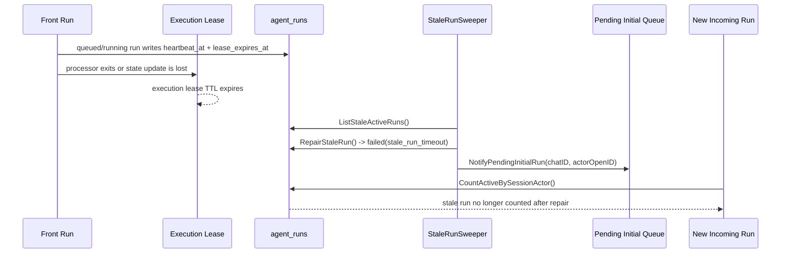

### 25.1 run liveness 字段已经成为真实状态，而不是预留字段

#### A. `queued` 状态就会落首跳 heartbeat

run liveness 辅助逻辑集中在 [`run_liveness.go`](./run_liveness.go)：

- [`applyRunExecutionLiveness`](./run_liveness.go)
- [`seedQueuedRunLiveness`](./run_liveness.go)
- [`AgentRun.IsStaleActive`](./run_liveness.go)

当前会在下列“进入 `queued`”的路径落首跳 liveness：

- 新建 run：[`RunCoordinator.StartShadowRun`](./coordinator.go)
- attach 现有 run 回到 `queued`：[`RunCoordinator.attachShadowRun`](./coordinator.go)
- resume 后回到 `queued`：[`RunCoordinator.ResumeRun`](./coordinator.go)
- continuation 再次把 run 回推到 `queued`：[`RunCoordinator.updateRunReplyLifecycle`](./runtime_step_support.go)、[`ContinuationProcessor.continueQueuedCapabilityTail`](./continuation_processor_support.go)

此时的特征是：

- `heartbeat_at` 已经写入
- `lease_expires_at` 已经写入
- `worker_id` 可以为空字符串

也就是说，run 还没真正进入执行临界区时，也能在 DB 中留下“最后一次被 runtime 接管/重新排队”的时间戳。

#### B. 真正执行时会写入 worker 并持续续约

执行期间仍然保留 Redis execution lease，负责临界区互斥：

- 获取/释放：[`ContinuationProcessor.withExecutionLease`](./continuation_processor.go)
- Redis 实现：[`AgentRuntimeStore.AcquireExecutionLease`](../../../infrastructure/redis/agentruntime.go)、[`AgentRuntimeStore.RenewExecutionLease`](../../../infrastructure/redis/agentruntime.go)

在持有 execution lease 后，processor 还会推进 run 级 heartbeat：

- 首次进入执行态：[`RunCoordinator.startRunExecution`](./runtime_step_support.go)
- 执行期续约：[`ContinuationProcessor.renewRunExecutionHeartbeat`](./continuation_processor.go)
- 刷新函数：[`RunCoordinator.refreshRunExecutionLiveness`](./runtime_step_support.go)

因此当前有两层不同职责：

- execution lease：防止多个 processor 同时推进同一 `chatID + actorOpenID`
- run liveness：判断某条 `AgentRun` 在 DB 里的 active 状态是否还活着

#### C. 等待态和终态会清理 liveness

当前实现不会让 `waiting_*` 或终态保留旧 heartbeat：

- 进入审批等待：[`moveRunToWaitingApproval`](./approval_runtime.go)
- 进入等待/终态收尾：[`RunCoordinator.updateRunReplyLifecycle`](./runtime_step_support.go)
- stale repair / cancel / finish：[`RunCoordinator.RepairStaleRun`](./stale_run_sweeper.go)、[`clearFinishedRunState`](./reply_completion.go)、[`clearCancelledRunState`](./coordinator.go)

所以 `heartbeat_at` 的语义是：

- “当前 queued/running run 最近一次被接管或续约的时间”
- 不是“所有 waiting/finished run 永久保留的历史字段”

### 25.2 stale-run sweeper 现在负责修复 DB 侧卡死 run

#### A. 扫描范围与判定规则

后台修复 job 在：

- [`StaleRunSweeper`](./stale_run_sweeper.go)
- wiring：[`BuildStaleRunSweeper`](./runtimewire/runtimewire.go)
- bootstrap：[`startStaleRunSweeper`](../../../cmd/larkrobot/bootstrap.go)

repository 扫描入口是：

- [`RunRepository.ListStaleActiveRuns`](../../../infrastructure/agentstore/repository.go)

当前只扫描两种 active run：

- `queued`
- `running`

stale 判定走统一函数 [`AgentRun.IsStaleActive`](./run_liveness.go)：

- 有 lease 时：`lease_expires_at <= now`
- 没有 lease 时：回退到 legacy `updated_at <= legacyCutoff`

这个 legacy fallback 仍然保留，是为了兼容历史 run 和老数据，不要求所有旧记录都已经带 heartbeat 字段。

#### B. repair 动作

真正的修复逻辑在 [`RunCoordinator.RepairStaleRun`](./stale_run_sweeper.go)：

- `queued/running -> failed`
- `error_text = "stale_run_timeout"`
- 清空 `waiting_reason` / `waiting_token`
- 清空 `worker_id` / `heartbeat_at` / `lease_expires_at`
- 设置 `finished_at`
- `repair_attempts++`

repair 完成后，还会复用现有清理链路：

- 清 session `ActiveRunID`
- 清 actor/chat active slot
- `NotifyPendingInitialRun(chatID, actorOpenID)`

所以真正阻塞排队链的 DB active run，现在有自动退出路径。

#### C. `activeRunTTL` 仍然不是判活依据

这一点和之前的判断保持一致：

- [`defaultActiveRunTTL`](./coordinator.go) 不是 run heartbeat
- Redis active slot 仍然只是协调状态
- stale 判定的权威来源是 DB 中的 `heartbeat_at/lease_expires_at` 与 repair 结果

### 25.3 pending scope sweeper 仍然只做唤醒，不做修 run

[`Sweeper.handleScope`](./initial/pending_scope_sweeper.go) 的职责没有变化：

- 看 backlog
- 看 active execution lease
- 决定 clear / skip / reschedule

它仍然不负责：

- 直接改 `agent_runs.status`
- 判定某条 run 是否 stale
- 自己执行 run repair

这部分修复职责已经显式转移给 [`StaleRunSweeper`](./stale_run_sweeper.go)。两者现在的分工是：

- pending scope sweeper：负责“scope 该不该继续被唤醒”
- stale run sweeper：负责“前面那条 DB active run 该不该被判死并释放阻塞”

### 25.4 pending queue 现在有最大等待时间兜底

pending worker 处理逻辑在 [`initial/pending_worker.go`](./initial/pending_worker.go)。

当前已落地的治理是：

- `ErrRunSlotOccupied` 仍然视为可重试错误
- 但如果 `PendingRun.RequestedAt` 存在，且等待时间超过 `defaultMaxQueueAge = 48h`
- worker 会直接丢弃该 item，而不是无限回队

过期后的动作：

- 优先 patch 原排队卡片：[`LarkRunStatusUpdater.MarkExpired`](./initial/pending_worker.go)
- 文案为：
  - `排队超时。`
  - `等待时间过长，已停止继续排队，请重新发起任务。`
- scope queue 为空时会继续走清理

这里刻意保守的兼容策略是：

- 只有 `RequestedAt` 非零才启用 expiry
- 老 payload 没有 `RequestedAt` 时，不会被误伤

所以现在的 queue expiry 语义是“兜底治理”，不是“所有 pending item 的强制 SLA”。

### 25.5 仍然保留的边界

当前实现并没有把所有 active/paused 状态都纳入自动修复：

- `waiting_approval`
- `waiting_schedule`
- `waiting_callback`

这些状态现在仍然不会被 [`StaleRunSweeper`](./stale_run_sweeper.go) 自动 fail。

原因是它们可能代表真实的外部等待：

- 人工审批还没点
- 定时调度还没触发
- callback 还没返回

如果直接按 heartbeat/lease 把它们一律判死，误伤成本比 `queued/running` 更高。

### 25.6 对前文相关章节的修正理解

因此，前面关于 pending queue / execution lease / scope sweeper 的章节，现在应当这样理解：

- execution lease 解决的是并发互斥
- run heartbeat + stale sweeper 解决的是 DB active run 的自愈
- pending queue expiry 解决的是“即使 repair 滞后，队列项也不能永久等待”
- 当前最保守的空白区仍然是 `waiting_*` 的超时治理和更细的 metrics / rollout flags
